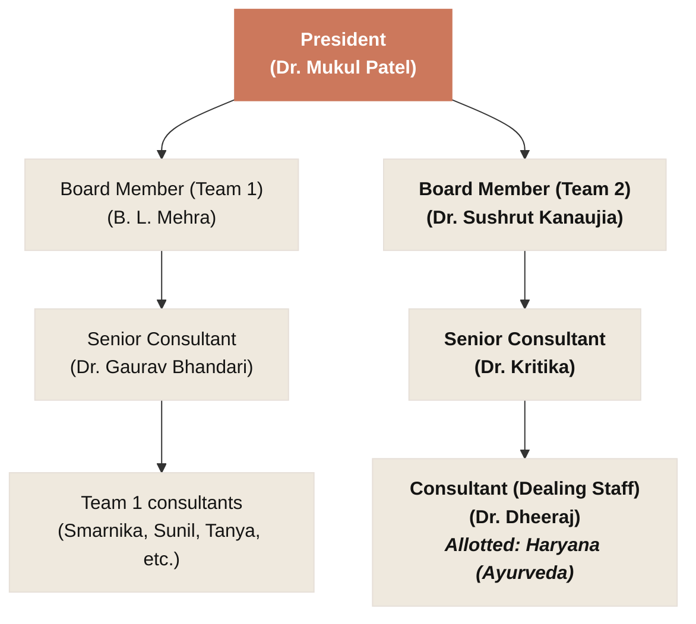

# NCISM Assessment Portal — System Architecture & Workflow Summary

This document provides a high-level summary of how the NCISM Assessment Portal works. It maps the user hierarchy, reporting chain, and regulatory case flow specifically for **Gaur Brahmin Ayurvedic College & Hospital (AYU0038)** in Rohtak, Haryana.

> **⚠️ Scope (TCS boundary).** Under the revised project scope, the **20–50-page Regulatory/Assessment Report is generated externally by TCS** (TCS conducts the visitation and authors the report). This platform's boundary **begins when the report is received** — production intake is the **TCS API**; until it exists, the **Visitor-portal manual upload shown below is a temporary workaround, not the production architecture**. Everything downstream of receipt (extraction, rule/punitive computation, review, clarification, hearing, board, letters, closure) is unchanged and remains this platform's work.

---

## 1. User Hierarchy & Allotment Scoping

The NCISM organization enforces a strict hierarchical chain of reporting and supervision.

- Case routing is determined by **allotments** (`staff_allotments` table) based on the **System of Medicine** (Ayurveda, Unani, Siddha, Sowa-Rigpa) and the **State** of the institution.
- **Gaur Brahmin Ayurvedic College & Hospital (AYU0038)** is an **Ayurveda** college in **Haryana**.
- **Dr. Dheeraj** is the allocated Consultant (dealing staff) for Haryana/Ayurveda.

### Reporting Chain for Case `AYU0038`

Since `AYU0038` is an **Ayurveda** college in **Haryana**, the case is routed to **Dr. Dheeraj** (Consultant allotted to Haryana).

---

## 2. End-to-End Case Workflow (Case `AYU0038`)

When a visitor uploads the visitation report for **AYU0038**, it drives a state-machine-guided maker-checker review lifecycle. This diagram maps the case from the initial upload, through the automated parsing engine (OpenDataLoader + CDM + Rule Evaluator), maker-checker submissions, the four board decision branches (Approve / Reject / Request Clarification / Request Hearing), structured board decisions, board-meeting dispatch, and penalty monitoring. Every edge below corresponds to a real transition in `workflow.service.js`.

```mermaid
flowchart TD
    %% Styling definitions
    classDef visitor fill:#efe9de,stroke:#e6dfd8,color:#141413;
    classDef consultant fill:#cc785c,stroke:#cc785c,color:#ffffff;
    classDef senior fill:#efe9de,stroke:#e6dfd8,color:#141413;
    classDef board fill:#efe9de,stroke:#e6dfd8,color:#141413;
    classDef college fill:#efe9de,stroke:#e6dfd8,color:#141413;
    classDef system fill:#181715,stroke:#181715,color:#faf9f5;
    classDef terminal fill:#181715,stroke:#cc785c,stroke-width:2px,color:#faf9f5;

    %% Nodes
    Start([1. Start: TCS generates the 20-50pp Regulatory Report - external])

    VisitorUploader["<b>Visitor</b> (visitor@ncism.local)<br/>Interim workaround: uploads the TCS report PDF<br/><i>production: TCS API</i>"]:::visitor
    UploadedState{"State: <b>uploaded</b>"}

    consultantProcess["<b>Consultant</b> (Dr. Dheeraj)<br/>Allotted Haryana/Ayurveda<br/>Clicks 'Process'"]:::consultant

    subgraph AsyncPipeline ["Async Processing Engine (pg-boss Worker)"]
        OpenDataLoader["1. OpenDataLoader CLI<br/>(Extract PDF to element JSON)"]:::system
        CDM["2. CDM Builder Stage<br/>(Assemble section tree & normalize tables)"]:::system
        Rules["3. Rule Evaluator & Punitive Policy<br/>(Resolve active ruleset, compute penalties)"]:::system
        Reporter["4. Assessment Report Template<br/>(Generate MARB report JSON)"]:::system

        OpenDataLoader --> CDM --> Rules --> Reporter
    end

    ProcessedState{"State: <b>processed</b>"}

    consultantSubmit["<b>Dr. Dheeraj</b> (consultant)<br/>Reviews findings, clicks 'Submit'"]:::consultant
    SeniorReviewState{"State: <b>senior_review</b>"}

    SeniorForward["<b>Senior Consultant</b> (Dr. Kritika)<br/>Forwards to Board, or Returns for rework"]:::senior
    UnderValidationState{"State: <b>under_validation</b>"}
    BoardReviewState{"State: <b>board_review</b>"}

    ClarifyState{"State: <b>clarification_open</b>"}
    CollegeRespond["<b>College User</b> (college.ayu0038@ncism.local)<br/>Submits Response + Proofs"]:::college
    ResponseSubmitted{"State: <b>clarification_responded</b>"}

    HearingReq{"State: <b>hearing_requested</b>"}
    PresidentAppoint["<b>President</b> (Dr. Mukul Patel)<br/>Appoints Hearing Committee & Date"]:::board
    HearingSched{"State: <b>hearing_scheduled</b>"}
    CommitteeMinutes["<b>Hearing Committee</b> (hearing1 & hearing2)<br/>Conducts hearing & records minutes"]:::visitor

    RejectedState{"State: <b>rejected</b>"}

    BoardApprove["<b>Board Member</b> (Dr. Sushrut Kanaujia)<br/>Clicks 'Approve' & selects structured outcome"]:::board
    ApprovedState{"State: <b>approved</b>"}

    SecretariatMeeting["<b>Secretariat</b> (secretariat@ncism.local)<br/>Schedules Board Meeting & adds case to agenda"]:::senior
    FinalOrder["<b>Secretariat</b> reviews auto-drafted Final Order<br/>Clicks 'Dispatch'"]:::senior
    ClosedState([State: <b>closed</b>]):::terminal

    ComplianceLedger["<b>Dr. Dheeraj</b> (Consultant)<br/>Logs manual penalties (policy-derived ₹ rate) & tracks payments"]:::consultant
    CompliedState([Compliance: <b>complied</b>]):::terminal

    %% Intake to processing to maker-checker
    Start --> VisitorUploader
    VisitorUploader --> UploadedState
    UploadedState -->|Dr. Dheeraj owns case| consultantProcess
    consultantProcess --> AsyncPipeline
    Reporter --> ProcessedState
    ProcessedState --> consultantSubmit
    consultantSubmit --> SeniorReviewState
    SeniorReviewState -->|Dr. Kritika reviews| SeniorForward
    SeniorForward -->|Forward to Board| BoardReviewState
    SeniorForward -->|Return for rework| UnderValidationState
    UnderValidationState -->|consultant resubmits| consultantSubmit

    %% Board action: Request Clarification
    BoardReviewState -->|"Request Clarification<br/>(Auto-drafts Clarification Letter)"| ClarifyState
    ClarifyState --> CollegeRespond
    CollegeRespond --> ResponseSubmitted
    ResponseSubmitted -->|"Consultant reviews (remarks + verdict)"| ClarReviewed{"State: <b>clarification_reviewed</b>"}
    ClarReviewed -->|Accepted → submit| consultantSubmit
    ClarReviewed -->|Requires revision R1| ClarifyState

    %% Board action: Request Hearing
    BoardReviewState -->|Request Hearing| HearingReq
    HearingReq --> PresidentAppoint
    PresidentAppoint -->|Auto-drafts Hearing Notice| HearingSched
    HearingSched --> CommitteeMinutes
    CommitteeMinutes -->|Minutes submitted| BoardReviewState

    %% Board action: Reject
    BoardReviewState -->|Reject| RejectedState
    RejectedState -->|consultant revises| UnderValidationState

    %% Board action: Approve
    BoardReviewState -->|"Approve (structured outcome)"| BoardApprove
    BoardApprove -->|Pre-seeded punitive outcome| ApprovedState

    %% Dispatch + compliance
    ApprovedState -->|Auto-derives seat reductions| SecretariatMeeting
    SecretariatMeeting --> FinalOrder
    FinalOrder -->|"Dispatches Final Order (only if compliance=complied)"| ClosedState

    ApprovedState -->|Initiates Compliance Monitoring| ComplianceLedger
    ComplianceLedger -->|All penalties paid/waived| CompliedState

    %% Node styling
    style Start fill:#faf9f5,stroke:#141413,color:#141413;
    style ClosedState fill:#181715,stroke:#cc785c,color:#faf9f5;
    style CompliedState fill:#181715,stroke:#cc785c,color:#faf9f5;
```

---

## 3. Detailed Walkthrough of the Case Lifecycle

### 3.1 Regulatory-Report Receipt (`uploaded` State)

- **Source of the report:** the 20–50-page Regulatory Report is **generated externally by TCS** (TCS conducts the visitation). This platform does not author it.
- **Production intake (intended):** TCS delivers the report to the platform via its API; the case is created on receipt.
- **Interim intake (current workaround):** Actor = Visitor (`visitor@ncism.local`) — selects `AYU0038`, enters basic parameters (visitation dates, intake = `60`), and **manually uploads the TCS-generated PDF report** because the TCS API is not yet available. This manual upload is temporary, not the production design.
- **Output:** Case is created in the database under `applications` with `status = 'uploaded'`. Downstream processing (§3.2) is unchanged.

### 3.2 Automated Document Parsing & Rule Processing (`processed` State)

- **Actor:** Consultant (**Dr. Dheeraj**).
- **Action:** Opens the case from their queue (routed because Haryana is in their allotments) and triggers **Process**.
- **System Engine Steps (Async pg-boss Queue):**
  1. **OpenDataLoader CLI:** Runs extraction on the PDF to create a structured JSON.
  2. **Canonical Document Model (CDM):** Organizes elements, stitches cross-page tables, and flattens column/row spans.
  3. **Rule Evaluator:** Resolves the **active ruleset** for the case's `(system, level)` from the ruleset registry (Admin → Rulesets) — for `AYU0038` (Ayurveda, UG) that is `mesar-ug-ayurveda-2024/v1` — then computes teacher-student ratios, bed occupancy thresholds, and department requirements. Six rulesets are active (UG Ayurveda/Unani/Sowa-Rigpa + PG Ayurveda/Unani/Siddha); each case is assessed against its own system's ruleset, not a hardcoded one.
  4. **Punitive Engine:** Maps any deficiencies (e.g. ghost faculty, lack of AEBAS biometric compliance) to specific punitive outcomes (e.g. 5% seat reduction per missing faculty, or complete denial).
- **Output:** An immutable **Assessment Report JSON** is generated and stored. Case status becomes `processed`.

### 3.3 Maker-Checker Submission (`senior_review` State)

- **Actor:** Consultant (**Dr. Dheeraj**).
- **Action:** Reviews the generated Assessment Report findings, logs notes, and clicks **Submit for Review**.
- **Output:** Case status changes to `senior_review`.

### 3.4 Supervisor Verification (`board_review` State)

- **Actor:** Senior Consultant (**Dr. Kritika**).
- **Action:** Reviews Dr. Dheeraj's submission.
  - If changes are needed, she **Returns** it to Dr. Dheeraj (`under_validation`); he reworks and resubmits, re-entering `senior_review`.
  - If clean, she clicks **Forward to Board**.
- **Output:** Case status changes to `board_review`.

### 3.5 Board Review & Intervention Cycles

The Board Member (**Dr. Sushrut Kanaujia**) reviews the case findings and has **four** actions available: **Approve**, **Reject**, **Request Clarification**, and **Request Hearing**.

#### Request Clarification (`clarification_open` → `clarification_responded` → `clarification_reviewed`)

1. **Board Member** clicks **Request Clarification**. The system automatically generates a formatted **Clarification Letter** containing the assessment shortcomings.
2. The case moves to `clarification_open`.
3. **College User** (`college.ayu0038@ncism.local`) sees the case in their queue, inputs a response text, attaches evidentiary PDFs, and clicks **Submit** → `clarification_responded`.
4. **Dr. Dheeraj** (the **Consultant**) opens a **Clarification Review** panel: reads the submitted text, previews/downloads the attached PDF, records **review remarks + a verdict** → `clarification_reviewed`.
   - **Accepted** → **Submit** re-enters the maker-checker chain (`senior_review`).
   - **Requires revision (R1)** → the case returns to `clarification_open` with the remarks so the college edits and resubmits. All review actions are recorded in the audit trail.

#### Request Hearing (`hearing_requested` → `hearing_scheduled` → `board_review`)

1. **Board Member** clicks **Request Hearing** (status: `hearing_requested`).
2. **President** (**Dr. Mukul Patel**) reviews the request, appoints a committee (e.g. `hearing1`, `hearing2`), sets a date, and sends the **Hearing Notice** (status: `hearing_scheduled`).
3. **Hearing Committee** conducts the session, records meeting minutes and a verdict, returning the case to `board_review`.

#### Reject (`rejected` → `under_validation`)

1. **Board Member** clicks **Reject** (status: `rejected`).
2. **Dr. Dheeraj** reopens the case for revision (`under_validation`), reworks it, and resubmits it up the maker-checker chain.

### 3.6 Structured Board Decision (`approved` State)

- **Actor:** Board Member (**Dr. Sushrut Kanaujia**).
- **Action:** Clicks **Approve (decide)**. The system pre-fills the dialog with the auto-derived outcome from the punitive engine (e.g., `reduce-intake` to `50` seats due to teacher deficiencies). The Board confirms/edits this decision.
- **Output:** Status changes to `approved`. Auto-derived penalties (seat reductions) are written to the database, and compliance monitoring is initialized.

### 3.7 Board Meeting & Final Dispatch (`closed` State)

- **Actor:** Secretariat (`secretariat@ncism.local`).
- **Action:**
  1. Schedules a Board Meeting (e.g. `MARB/2026/08`) and adds `AYU0038` to the agenda.
  2. Opens `AYU0038` and reviews the **Final Order Letter**, which is auto-drafted containing the board's decision, shortcomings, and applicable regulations. The addressee block renders in proper stacked government-letter format (screen + PDF + Word alike).
  3. Clicks **Dispatch Final Order** — **only available once `compliance = complied`**; while penalties are pending the action is blocked (button hidden + a banner explains why, and a forced call returns `COMPLIANCE_INCOMPLETE`).
- **Output:** Case status reaches its terminal state: `closed`. The college can now read the official Final Order.

### 3.8 Penalty Enforcement & Compliance

- **Actor:** Consultant (**Dr. Dheeraj**).
- **Action:** Manages the penalties ledger for the case. He reviews auto-derived seat reductions and adds any manual penalties (such as monetary fines for ghost faculty or teacher code revocations). He updates payment/compliance status.
- **Output:** When all penalties are resolved, the case compliance header automatically updates to `complied`.

---

## 4. Key Official Documents Generated

The system contains an automated **Letter Template Engine** (`letter.service.js`) that produces official NCISM-formatted PDF drafts. These drafts populate automatically from case data:

| Document Type            | Triggers on State / Action                          | Source Data Included                                                                               |
| ------------------------ | --------------------------------------------------- | -------------------------------------------------------------------------------------------------- |
| **Clarification Letter** | Board requests clarification (`clarification_open`) | List of shortcomings extracted from the report, signatory info, and college contact details.       |
| **Hearing Notice**       | President schedules hearing (`hearing_scheduled`)   | Shortcomings list, hearing committee panel, date/time, and instructions.                           |
| **Final Order**          | Secretariat dispatches order (`closed`)             | Board's final outcome decision, approved seats count, applied penalties, and relevant regulations. |

Every issued letter, the **Assessment Report**, and confirmed **meeting minutes** are **downloadable as Markdown, PDF, or Word (.docx)** (generated client-side from the stored markdown). The uploaded visitation report is served back for an in-app **PDF viewer** (case → **Documents** tab) and a one-click **Visitor Report** download via `GET /applications/:id/source.pdf` (`application:read`).

> **Access:** login supports optional **TOTP MFA** (Settings → Two-factor → 6-digit step-up). The `college.ayu0038@ncism.local` account (password `Password123`) is seeded so this case's clarification/hearing cycle can be driven end-to-end.
