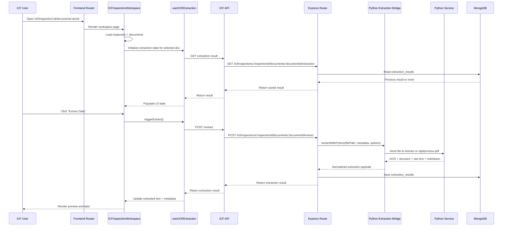
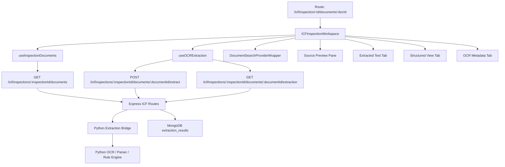

# Inspection Workspace Audit

This document explains how the inspection workspace works end to end, including how a document is selected, how extraction is triggered, how the backend stores results, and how the frontend renders the document experience.

## 1. High-level purpose

The inspection workspace is the main document-analysis experience for ICF users. It is not a separate, purpose-built "document details" screen; instead, it is a route-driven workspace page that can load either:

- an inspection-level view with a document list, or
- a dedicated document-analysis view for one document.

The main route is:

- `/icf/inspection/:id`
- `/icf/inspection/:id/documents/:docId`

The route is wired in [frontend/src/app/routes.jsx](frontend/src/app/routes.jsx) and rendered by [frontend/src/app/features/icf/ICFInspectionWorkspace.jsx](frontend/src/app/features/icf/ICFInspectionWorkspace.jsx).

## 2. Main frontend flow

### Entry points

1. The router resolves the inspection and optional document ID from the URL.
2. The workspace page loads:
   - inspection metadata,
   - the inspection’s documents,
   - and any saved extraction result for the selected document.
3. The selected document is shown in a two-pane experience:
   - left pane: source document preview
   - right pane: extracted text / structured view / OCR metadata

### Core frontend components

- [frontend/src/app/features/icf/ICFInspectionWorkspace.jsx](frontend/src/app/features/icf/ICFInspectionWorkspace.jsx)
  - Main orchestrator for the page
  - Handles doc selection, search state, tab switching, and extraction actions

- [frontend/src/app/hooks/useInspectionDocuments.js](frontend/src/app/hooks/useInspectionDocuments.js)
  - Fetches documents for the inspection from the backend

- [frontend/src/app/hooks/useOCRExtraction.js](frontend/src/app/hooks/useOCRExtraction.js)
  - Loads prior extraction results or triggers new extraction
  - Maps backend results into the UI-friendly shape

- [frontend/src/api/icf.js](frontend/src/api/icf.js)
  - Central API wrapper for inspection and document extraction requests

## 3. How the page behaves

### When the page loads

- The route params provide `id` and optionally `docId`.
- The workspace calls the inspection endpoint to fetch the establishment metadata.
- It also calls the documents endpoint to list all documents linked to the inspection.
- If a `docId` is present, it becomes the selected document.

### When a user clicks a document

- The UI updates the selected document in local state.
- The extraction hook loads the existing extraction output for that document.
- If there is no prior extraction, the document remains in a pending state until the user triggers extraction.

### When the user clicks “Extract Data”

- The workspace calls the extraction endpoint for the selected document.
- The UI enters a processing state and shows a loading spinner.
- When the backend returns the result, the UI updates the right-side tabs with:
  - extracted text,
  - structured/Markdown view,
  - OCR metadata.

## 4. Backend request flow

The main backend route is [backend/src/routes/icf.routes.js](backend/src/routes/icf.routes.js).

### Relevant endpoints

- `GET /api/v1/icf/inspections/:inspectionId`
  - Returns inspection details plus establishment and region metadata.

- `GET /api/v1/icf/inspections/:inspectionId/documents`
  - Returns the documents belonging to the inspection’s establishment.

- `POST /api/v1/icf/inspections/:inspectionId/documents/:documentId/extract`
  - Triggers extraction for one document.

- `GET /api/v1/icf/inspections/:inspectionId/documents/:documentId/extraction`
  - Returns a saved extraction result for the document.

### What the backend does on extraction

1. It validates that the document belongs to the inspection’s establishment.
2. It checks whether the Python extraction service is available.
3. If available, it calls the Python bridge service.
4. It stores the extraction result in the `extraction_results` collection.
5. It returns the result to the frontend so the workspace can render it.

## 5. Extraction architecture

The actual extraction pipeline has two layers:

### A. Backend bridge

The bridge is implemented in [backend/src/services/python-extraction.service.js](backend/src/services/python-extraction.service.js).

It:

- sends the document file to the Python service,
- supports a fallback endpoint if the primary one is unavailable,
- normalizes the Python response into the format expected by the frontend and MongoDB.

### B. Python service

The Python service entrypoints are:

- [python-service/main.py](python-service/main.py)
- [python-service/app/main.py](python-service/app/main.py)

The Python layer is responsible for:

- OCR/text extraction,
- document structure extraction,
- markdown generation,
- rule-based parameter extraction,
- optional metadata generation.

### Python extraction modules involved

- [python-service/ocr.py](python-service/ocr.py)
  - OCR/text extraction pipeline

- [python-service/parser.py](python-service/parser.py)
  - Builds structured output and text-based extraction logic

- [python-service/markitdown_serializer.py](python-service/markitdown_serializer.py)
  - Converts digital documents into Markdown-like structure

- [python-service/digital_reconstructor.py](python-service/digital_reconstructor.py)
  - Helps reconstruct digital PDF content into richer structure

- [python-service/rule_engine.py](python-service/rule_engine.py)
  - Rule-based fallback extraction

## 6. Document preview behavior

The left-side document preview uses native browser embedding:

- PDF files use an `embed` tag.
- Image files use an `img` tag.
- Other file types use an `iframe`.

This means the workspace is using browser-native previewing rather than a dedicated PDF viewer library.

## 7. Data stored for each document

The document workflow depends on a few persisted artifacts:

- `documents` collection
  - file metadata, category, upload info, establishment linkage

- `extraction_results` collection
  - extracted text, markdown, metadata, processing status, field results

- `documents` file on disk
  - actual uploaded file used for preview and extraction

## 8. Mermaid diagram: end-to-end flow

## 9. Mermaid diagram: component view

## 10. Important implementation notes

- The inspection workspace is the current document-analysis surface, even for a single document.
- The extraction pipeline is backend-driven and persists results for later reuse.
- The UI can show both raw OCR text and structured/Markdown output.
- The system currently uses browser-native previewing rather than a dedicated PDF viewer component.
- The workspace is designed to be resilient: if no prior extraction exists, the user can trigger it manually.

## 11. Summary

In short, the inspection workspace works like this:

1. The user opens a document from an inspection.
2. The frontend loads the document and related inspection state.
3. If extraction exists, it is loaded; otherwise the user can run it.
4. The backend sends the file to the Python extraction service.
5. The extraction result is stored and then rendered in the workspace tabs.

This design keeps the document experience unified while allowing the extraction logic to live in a dedicated backend/Python pipeline.
