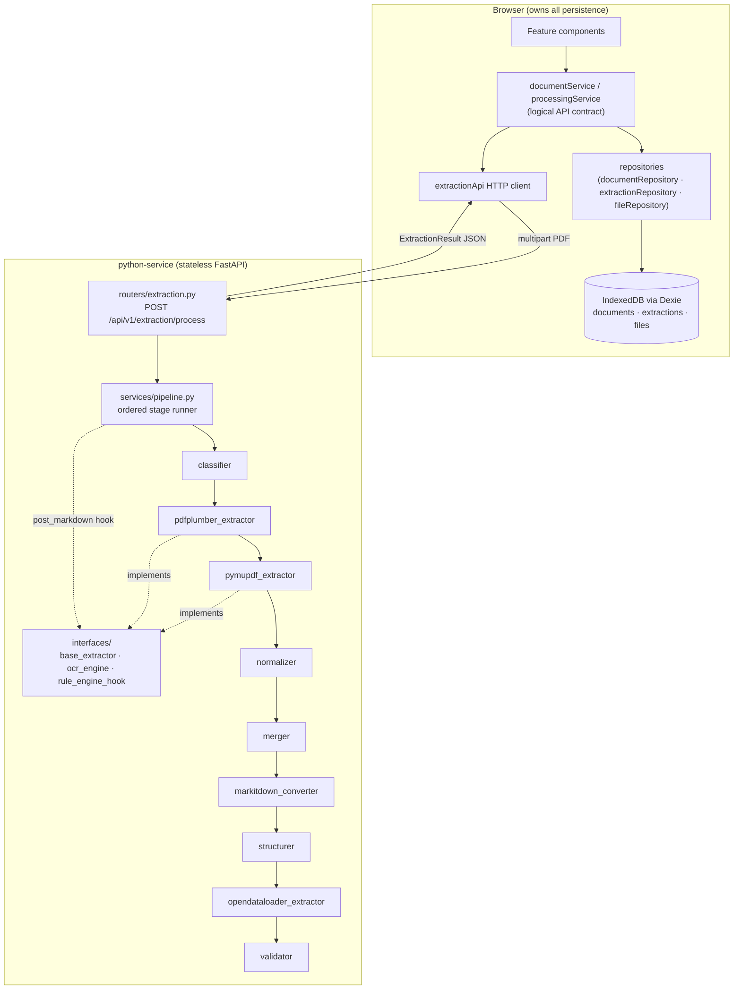
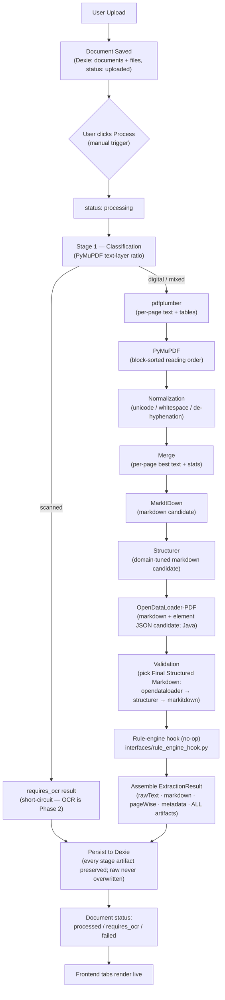

# NCISM Phase 1 — Document Intelligence Base: Architecture

Phase 1 delivers the document-intelligence foundation for the MARB-ISM
Assessment & Permission Management System: PDF upload, a staged extraction
pipeline, and a two-pane document workspace. Everything else (rule engine,
assessment generation, authentication, workflows) is out of scope and only
represented as extension points (§8).

Companion documents: [API.md](API.md) · [SCHEMA.md](SCHEMA.md)

---

## 1. Folder architecture

```
NCISM/
├── frontend/                          # React 19 + JavaScript + Vite + shadcn/ui + Tailwind v4
│   ├── components.json                #   shadcn configured with "tsx": false (pure JSX)
│   └── src/
│       ├── app/routes.jsx             #   "/" upload · "/documents/:id" details
│       ├── components/
│       │   ├── ui/                    #   shadcn primitives (button, card, table, tabs, badge,
│       │   │                          #     progress, separator, tooltip, sonner, skeleton, input)
│       │   └── layout/AppHeader.jsx   #   header + extraction-service health indicator
│       ├── features/
│       │   ├── upload/                #   Document Upload Workspace
│       │   │   ├── UploadWorkspace.jsx
│       │   │   └── components/        #   FileDropZone · UploadQueue · DocumentList · StatusBadge
│       │   └── document-details/      #   Document Details Workspace (65 / 35 split)
│       │       ├── DocumentDetailsWorkspace.jsx
│       │       └── components/        #   PdfViewer · PdfToolbar · ExtractionTabs · ProcessButton
│       │           └── tabs/          #   RawTextTab · StructureViewTab · OcrMetadataTab
│       ├── db/
│       │   ├── db.js                  #   Dexie schema (IndexedDB), status enums
│       │   └── repositories/          #   documentRepository · extractionRepository · fileRepository
│       ├── services/
│       │   ├── documentService.js     #   the 5-API logical contract (see API.md)
│       │   ├── processingService.js   #   manual-processing orchestration + status transitions
│       │   └── extractionApi.js       #   HTTP client → FastAPI
│       ├── hooks/                     #   useDocuments · useDocument · useExtraction · useUpload ·
│       │                              #     useServiceHealth (all liveQuery-based where applicable)
│       └── lib/                       #   pdf.js worker config + validation · format · cn()
│
├── python-service/                    # Stateless FastAPI extraction service
│   └── app/
│       ├── main.py                    #   app factory, CORS
│       ├── routers/                   #   health.py · extraction.py        (controller layer)
│       ├── services/                  #   ONE pipeline stage = ONE module  (service layer)
│       │   ├── pipeline.py            #   ordered stage runner + artifact assembly
│       │   ├── classifier.py          #   digital / scanned / mixed
│       │   ├── pdfplumber_extractor.py
│       │   ├── pymupdf_extractor.py
│       │   ├── normalizer.py          #   conservative per-engine text cleanup
│       │   ├── merger.py
│       │   ├── markitdown_converter.py
│       │   ├── structurer.py          #   domain-tuned structured-markdown candidate
│       │   ├── opendataloader_extractor.py  # OpenDataLoader-PDF (local mode; Java)
│       │   └── validator.py           #   selects the Final Structured Markdown
│       ├── interfaces/                #   extension points (no business logic)
│       │   ├── base_extractor.py      #   ABC every extraction engine implements
│       │   ├── ocr_engine.py          #   OCR contract — Phase 2
│       │   └── rule_engine_hook.py    #   no-op post_markdown hook — Phase 2
│       ├── schemas/extraction.py      #   Pydantic response models (wire contract)
│       └── utils/                     #   stats/timing · temp-file handling
│
└── docs/phase1/                       # this documentation set
```

---

## 2. Backend architecture diagram

The "backend" is split between a stateless Python processing service and a
client-side persistence layer (a deliberate POC decision — see §9).



Layer responsibilities:

| Layer | Location | Responsibility |
|---|---|---|
| Routers (controllers) | `app/routers/` | HTTP concerns only: validation of the upload, status codes. **No extraction logic.** |
| Pipeline orchestrator | `app/services/pipeline.py` | Stage ordering, timing, short-circuiting, result assembly |
| Stage services | `app/services/*.py` | One extraction responsibility each |
| Interfaces | `app/interfaces/` | Future-phase contracts (OCR, rule engine) |
| Frontend services | `src/services/` | The logical API; orchestration of status transitions |
| Repositories | `src/db/repositories/` | The only code that touches Dexie tables |

---

## 3. Frontend component hierarchy

```
App (BrowserRouter + Sonner Toaster)
└── AppRoutes
    ├── "/"  UploadWorkspace
    │   ├── AppHeader ── ServiceHealthIndicator
    │   ├── FileDropZone            (drag & drop + browse, multi-file)
    │   ├── UploadQueue             (per-file Progress)
    │   └── DocumentList            (Table: name · size · pages · StatusBadge · uploadedAt)
    │
    └── "/documents/:id"  DocumentDetailsWorkspace
        ├── AppHeader ── back link · filename · StatusBadge · ProcessButton · health
        ├── (left 65%)  PdfViewer
        │   ├── PdfToolbar          (prev/next · page N/M input · zoom ± · fit width · download)
        │   └── react-pdf <Document>/<Page>
        └── (right 35%) ExtractionTabs
            ├── RawTextTab          (verbatim <pre>, all-pages / per-page select)
            ├── StructureViewTab    (react-markdown + remark-gfm — Final Structured Markdown)
            ├── PipelineArtifactsTab(ordered per-stage artifacts + validation report)
            └── OcrMetadataTab      (metadata fields + validation summary + timings + engines)
```

Data flows through hooks, all live-updating via `dexie-react-hooks`
`useLiveQuery` — a status change written by `processingService` re-renders
every subscribed component without refetching.

---

## 4. Sequence diagram — upload → process → render

```mermaid
sequenceDiagram
    participant User
    participant Upload as UploadWorkspace
    participant Details as DocumentDetailsWorkspace
    participant DS as documentService
    participant PS as processingService
    participant Dexie as IndexedDB (Dexie)
    participant API as extractionApi
    participant FastAPI as python-service
    participant Pipe as pipeline.py

    User->>Upload: drop PDF(s)
    Upload->>DS: uploadDocument(file)
    DS->>DS: validate (.pdf, MIME, %PDF magic bytes)
    DS->>DS: read page count (pdf.js)
    DS->>Dexie: tx: documents.add + files.put(blob)
    Dexie-->>Upload: liveQuery → row appears (status: uploaded)

    User->>Details: open /documents/:id
    Details->>Dexie: load document, extraction, blob
    Details-->>User: PDF viewer + "Not processed yet"

    User->>Details: click "Process document"
    Details->>PS: process(id)
    PS->>Dexie: status = processing
    PS->>API: POST /api/v1/extraction/process (multipart PDF)
    API->>FastAPI: HTTP
    FastAPI->>Pipe: run(temp pdf path)
    Note over Pipe: classification → pdfplumber → PyMuPDF → normalize<br/>→ merge → MarkItDown → structurer → OpenDataLoader<br/>→ validate → assemble (all artifacts preserved)
    Pipe-->>FastAPI: ExtractionResult
    FastAPI-->>API: JSON
    API-->>PS: result
    PS->>Dexie: extractions.put(result) · status = processed
    Dexie-->>Details: liveQuery → tabs populate
    Details-->>User: raw text · structure view · metadata
```

---

## 5. Processing flow diagram



Document status machine:
`uploaded → processing → processed | failed | requires_ocr`
(re-process allowed from any terminal state).

---

## 6. Extraction pipeline details

**PDF pipeline** (`PDF_STAGES`):

| Stage | Module | Purpose | Output artifact |
|---|---|---|---|
| Classification | `classifier.py` | Per-page extractable-text ratio via PyMuPDF; ≥0.8 → `digital`, <0.1 → `scanned`, else `mixed` | `classification` |
| Digital extraction A | `pdfplumber_extractor.py` | Per-page `extract_text()` + `extract_tables()` (visitation reports are table-heavy) | `pdfplumber` |
| Digital extraction B | `pymupdf_extractor.py` | Per-page `get_text(sort=True)` — reading-order fallback | `pymupdf` |
| **Normalization** | `normalizer.py` | Conservative, structure-preserving cleanup per engine: Unicode NFC, control-char strip, whitespace/line-ending normalization, cautious line-break de-hyphenation | `normalized` |
| Merge | `merger.py` | Prefer pdfplumber text; fall back to PyMuPDF when a page yields <10 usable chars; record winning engine + per-page stats | `merged` (== `rawText`) |
| MarkItDown | `markitdown_converter.py` | Markdown candidate from the source PDF | `markitdown` |
| Structurer | `structurer.py` | Domain-tuned markdown candidate: filtered pdfplumber ruled tables as valid GFM, numbered-section headings, `Label : value` bolding, crop-artifact filtering; per-page `<!-- page N -->` markers | `structurer` |
| **OpenDataLoader-PDF** | `opendataloader_extractor.py` + `odl_json_structurer.py` | Local/fast-mode layout analysis; structured Markdown is **rebuilt from the element JSON** (faithful table grid with merged-cell spans) rather than the native serializer, using the tagged struct tree with a `cluster` fallback for poorly-tagged PDFs; element JSON (bounding boxes) preserved for the Rule Engine | `opendataloader` |
| **Validation** | `validator.py` | Selects the Final Structured Markdown by precedence `opendataloader → structurer → markitdown` after structural checks; emits a per-candidate report | `final` + `metadata.validation` |
| Assemble | `pipeline.py` | Timings, counts, language heuristic, engine versions, hook invocation, **ordered artifact list** | `ExtractionResult` |

**Why OpenDataLoader runs after MarkItDown.** MarkItDown and OpenDataLoader
are both whole-file converters — neither consumes the other's output, so their
ordering is a *precedence* choice, not a data dependency. OpenDataLoader is
placed last among the structural engines because (1) it is the only stage that
needs a JVM, so keeping it at the tail lets it **degrade gracefully** without
disrupting the proven Python-only core; (2) it is both the highest-fidelity
structural output and the sole source of the semantic element JSON, making it
the natural "last word" feeding Validation; (3) the cheap deterministic engines
run first. MarkItDown's pdfminer backend loses table structure (verified on
AYU0659), so it is now the last-resort candidate rather than a primary.
`metadata.structuredBy` and `metadata.validation` record which engine won and
why.

**Every stage output is preserved** as an ordered `StageArtifact` (see
[SCHEMA.md](SCHEMA.md)); no intermediate is overwritten, and `rawText` is never
replaced by markdown. The OpenDataLoader element JSON is retained as the future
Rule-Engine substrate (per-element bounding boxes support the SRS traceability
requirement).

**Office pipeline** (`OFFICE_STAGES`, DOCX/XLSX): MarkItDown is natively
excellent for OOXML formats — it is both the raw-text and structured source;
no classification, no normalization, no OpenDataLoader (which does not process
Office formats), no page-wise extraction (`pages: null`).

Measured on `AYU0659 100 intake capacity.pdf` (20 pages): full pipeline
≈ 8–11 s — pdfplumber ≈ 2.3 s, structurer ≈ 2.4 s, OpenDataLoader ≈ 1.8 s
(includes JVM startup), MarkItDown ≈ 1.7 s, PyMuPDF ≈ 0.3 s, normalization
≈ 34 ms, merge <1 ms. Raw text ≈ 36,560 chars / 5,820 words; OpenDataLoader
chosen as the Final Structured Markdown.

---

## 7. Storage model

See [SCHEMA.md](SCHEMA.md) for the full Dexie schema. Summary:

- `documents` — `{ id, filename, size, pages, status, uploadedAt }`
- `extractions` — `{ documentId, rawText, markdown, pageWiseExtraction[], artifacts[], processingTime, metadata, status, error, generatedAt }`
- `files` — `{ documentId, blob }` (kept separate so list queries never load PDF blobs)

Raw text and markdown are stored as **separate fields**, and `artifacts[]`
preserves every stage output in order; the pipeline never overwrites raw
extraction with structured output nor one artifact with another. `artifacts`
is a non-indexed field on the existing `extractions` record; the Dexie
`db.version(2)` bump keeps the same indexes and lets records upgrade in place.

---

## 8. Future extension points (created, intentionally empty)

| Future capability | Extension point in Phase 1 |
|---|---|
| OCR engines (scanned/handwritten) | `app/interfaces/ocr_engine.py` (ABC extending `BaseExtractor`); classifier already routes `scanned` PDFs to a `requires_ocr` result; `metadata.ocr` reserved slot |
| Rule engine → parameter extraction → assessment generator | `app/interfaces/rule_engine_hook.py::post_markdown(markdown, metadata)` invoked at the pipeline tail; `metadata.parameters` reserved slot |
| New pipeline stages (AI extraction, language detection) | `pipeline.py::STAGES` is an ordered list — new stages are inserted, the runner is untouched |
| Multilingual documents | `_detect_language` isolated as a replaceable heuristic; `language` field already on the wire |
| Additional extraction engines | implement `BaseExtractor` (`extract(pdf_path) -> RawPage[]`, `version()`) |
| Server-side persistence (real backend) | `documentService` is the single seam: replace its Dexie repositories with HTTP calls; feature components and hooks are untouched |
| New client tables (parameters, assessments) | Dexie `db.version(n+1)` schema upgrades |
| OCR metadata display | `OcrMetadataTab` renders from `extraction.metadata` generically — new fields appear without UI rework |

---

## 9. Technical decisions & rationale

1. **JavaScript only, no TypeScript** — project constraint. shadcn/ui was
   initialized with `"tsx": false`, generating `.jsx` components.
2. **IndexedDB via Dexie instead of a server database** — user decision for
   this mock/POC. PDFs are stored as Blobs client-side; the app fully works
   offline except for the processing call. Trade-off accepted: data is
   per-browser and non-shared; the `documentService` seam (§8) is the
   migration path to a real backend.
3. **React + Python only (no Node/Express layer)** — user decision. The
   layered backend from the ESIC reference architecture (controllers /
   services / interfaces) lives inside the FastAPI app; the Python "bridge"
   became a direct HTTP call since there is no server-side persistence to
   mediate.
4. **Manual processing trigger** — user decision, mirroring ESIC's
   "Extract Data" pattern. `POST /documents/:id/process` semantics are
   preserved; re-processing is idempotent (extractions are keyed by
   `documentId` and replaced).
5. **Structured markdown is chosen by a Validation stage** — three candidates
   are produced for PDFs (OpenDataLoader, the domain-tuned structurer, and
   MarkItDown) and `validator.py` selects the Final Structured Markdown by
   precedence `opendataloader → structurer → markitdown` after structural
   checks. MarkItDown consumes files (not raw text); for DOCX/XLSX it is the
   engine of record. Raw text and markdown remain separately stored.
11. **OpenDataLoader-PDF, local mode, positioned after MarkItDown** — it is the
    highest-fidelity structural engine and the only source of element JSON with
    bounding boxes (the Phase-2 Rule-Engine substrate). It runs after MarkItDown
    because neither consumes the other and OpenDataLoader is the natural "last
    word" for Validation; running it last also isolates its JVM dependency.
    Hybrid AI/OCR mode is out of Phase-1 scope. Image extraction is disabled so
    the stateless service writes nothing to disk.

    **Structured Markdown is rebuilt from the element JSON, not the native
    serializer.** OpenDataLoader's own Markdown serializer flattens borderless /
    multi-line-cell / merged-cell tables (e.g. "Visitor Details", "Constructed
    Area College Details") into loose paragraphs and bullet lists and drops
    column mapping. The element JSON, by contrast, retains the faithful table
    grid — every cell with its `row/column number` and `row/column span`. A
    dedicated builder (`odl_json_structurer.py`) walks that JSON in reading
    order and emits headings, GFM tables (merged spans expanded so columns
    always align), and lists. It also emits a list item's own `content` (not
    just its children), which restores sections whose data is tagged that way —
    e.g. the 2.8 Bio-metric / 2.9 College-Website Q&A blocks, reflowed into
    `**Question:** Answer` lines — while header-band items (which wrap a table)
    are skipped so their concatenated labels are not spilled as stray text.

    **Column headers come from a curated NCISM map.** These PDFs tag each
    table's header *band* as a separate, concatenated block with no per-column
    boxes and label counts that often disagree with the body, so headers cannot
    be aligned automatically. `ncism_table_headers.py` maps the (normalised)
    section title to the correct MSR/MESAR column labels, applied by
    `_table_md` **only when the label count equals the reconstructed column
    count**. On any mismatch (a template variant or an unmapped table) it falls
    back to the inline-header heuristic, and failing that an empty header row
    (a data row is never promoted to a header), with the section heading above
    supplying the title. This never misaligns data.

    **Grouped (multi-row) headers render as HTML.** Some schedules — e.g. 3.1
    Teaching Staff Verification — carry a two/three-level header (group labels
    spanning several child columns) that the JSON does not preserve: the grid is
    data-only (every cell span = 1) and the merged band survives only as a flat
    concatenated string. GFM cannot express grouped headers, so
    `ncism_table_headers.py` also holds a curated *multi-row* spec
    (`(label, colspan, rowspan)` per cell) applied — again only on an exact
    column-count match — by `structured_header_for`; `_table_md` then emits an
    HTML `<table>` (`<thead>` with real `colspan`/`rowspan`, `<tbody>` from the
    reconstructed grid). This renders through `rehype-raw`, already enabled in
    the Structure View and Pipeline Artifacts tabs.

    **Clipped heading bands are de-garbled.** A shaded title band is sometimes
    tagged as a character-clipped run concatenated with the clean title (e.g.
    `"3 T hi t ff (S h d l V) 3. Teaching staff (Schedule-V)"`).
    `_clean_heading_text` detects the artifact (mostly one/two-character tokens,
    mirroring the structurer's `_is_garbled` guard) and keeps the trailing
    well-formed numbered title, so the heading reads `3. Teaching staff
    (Schedule-V)`. Clean headings pass through untouched and paragraphs are never
    dropped.

    **List-item `content` is restored for table wrappers.** NCISM PDFs tag whole
    sections (cover-page metadata, 2.4.1 subsections, 2.7 status blocks) as a
    single list item whose `content` holds run-on ``Label : value`` pairs and/or
    a numbered subsection title, while the `kids` carry headings, paragraphs and
    the table grid. Previously, any list item with a table child skipped
    `content` entirely (to avoid spilling concatenated header bands), which
    dropped the institution block, visitation metadata and subsection titles.
    The builder now: (1) splits `content` into prose vs a header-band suffix,
    (2) emits known form-field pairs via a curated label list (multi-word values
    safe), (3) injects cover-page fields before the ``Visitation Details``
    marker,     (4) emits numbered subsection headings (e.g. ``2.4.1 …``) before the
    nested table, and (5) threads the header-band suffix into `_table_md` via
    `ctx["header_band"]` so column labels can be recovered.

    **Header bands become column labels.** When a list item's `content` is a
    pure concatenated header band (e.g. 3.4 ``Sr. No. Name of Absent Teacher
    …``), `_is_pure_header_band` keeps the band intact (the old split-on-
    ``Department`` rule had truncated labels). `_table_md` then resolves headers
    in order: curated map → `headers_from_band` (greedy longest-phrase parse,
    exact column-count match) → inline-header heuristic → empty row. Additional
    curated entries cover 3.4, 4.1, 5.1, 5.2, 6.1, 2.7, and 3.6.

    **Section gap-fill before validation.** OpenDataLoader's struct_tree can
    omit entire numbered sections (e.g. 3.6 on AYU0659) while still passing the
    50 % character-coverage gate. `section_gap_fill.py` compares numbered
    section IDs in the ODL markdown against the structurer candidate, verifies
    the body text is genuinely absent, and splices missing blocks from the
    structurer in reading order before Validation. Spliced section IDs are
    recorded on the final artifact (`sections_spliced`, `gap_fill_donor`).

    **Per-document table strategy.** The builder runs on the PDF's tagged
    structure tree (`use_struct_tree=True`), which yields the richest, most
    accurate table set. Because tag quality varies, if the struct-tree
    reconstruction retains < 50 % of the merged raw text (a poorly-tagged PDF
    that dropped content — measured ≈ 0.12–0.14 vs ≈ 0.75 for a well-tagged
    one), the stage retries with the geometric `cluster` table method and keeps
    the richer reconstruction. The chosen mode is recorded on the
    `opendataloader` artifact's engine label.
12. **Graceful degradation** — OpenDataLoader needs a Java 11+ runtime and
    spawns a JVM per document. If Java is missing or a conversion fails, the
    stage records a `failed`/unproduced artifact and the pipeline continues;
    Validation falls back to the structurer / MarkItDown. The Python-only core
    never breaks.
13. **Every intermediate artifact is preserved** — the extraction result carries
    an ordered `artifacts[]` (classification, pdfplumber, pymupdf, normalized,
    merged, markitdown, structurer, opendataloader, final). Nothing is
    overwritten, so the full pipeline history is inspectable and auditable.
6. **Two digital engines merged (pdfplumber preferred, PyMuPDF fallback)** —
   pdfplumber gives better line/table fidelity on these visitation reports;
   PyMuPDF's sorted block text protects against pages where pdfplumber
   returns nothing. The winning engine is recorded per page for
   traceability.
7. **react-pdf (pdf.js) instead of native `<embed>`** (ESIC used embed) —
   the zoom / fit-width / page-indicator / direct-jump requirements need
   programmatic control that native embedding cannot offer.
8. **Stateless Python service** — uploads land in a temp file that is always
   deleted; the service can be scaled/restarted freely and holds no state
   that could diverge from the client's store.
9. **camelCase on the Python wire schema** — the frontend persists the
   response verbatim into Dexie; one naming convention end-to-end beats a
   mapping layer for a POC.
10. **CORS restricted to localhost origins** — local POC posture; revisit
    with real deployment.

---

## 10. Intentionally deferred to Phase 2+

- **OCR engines** (Tesseract / cloud OCR / handwriting models) — only the
  interface and the `requires_ocr` routing exist.
- **Scanned, handwritten and multilingual document support** — language
  detection is a placeholder heuristic.
- **Rule engine, parameter extraction, assessment report generation** —
  only the no-op `post_markdown` hook and `metadata.parameters` slot exist.
- **Authentication, roles, permissions** — none, per Phase 1 scope.
- **NCISM workflows** (scrutiny, visitation, clarifications, board meetings,
  hearings, letters) — none.
- **Server-side persistence & multi-user sharing** — Dexie is per-browser.
- **Document deletion / versioning / re-upload de-duplication.**
- **Borderless / merged-cell table reconstruction** — recovered as real GFM
  tables by rebuilding from the OpenDataLoader element JSON (see decision 11).
  Standard NCISM schedules get correct column headers from the curated
  `ncism_table_headers` map; tables outside the map (or whose column count
  changed) render with an empty header row (labels are not column-alignable),
  the section heading above supplying the title. On poorly-tagged PDFs that fall
  back to the `cluster` method, borderless tables the geometric detector misses
  may still degrade to text/bullets.
- **Grouped multi-row headers** are reconstructed only from a curated spec
  (currently 3.1 Teaching Staff) and rendered as HTML; other grouped grids
  (e.g. 4.1 / 6.1) flatten to a single header row until their exact column
  structure is authored into `ncism_table_headers.STRUCTURED_HEADERS`.
- **AI-assisted extraction** (mandated by PG Regulations Ch. VIII 43(5)) —
  future pipeline stage.
