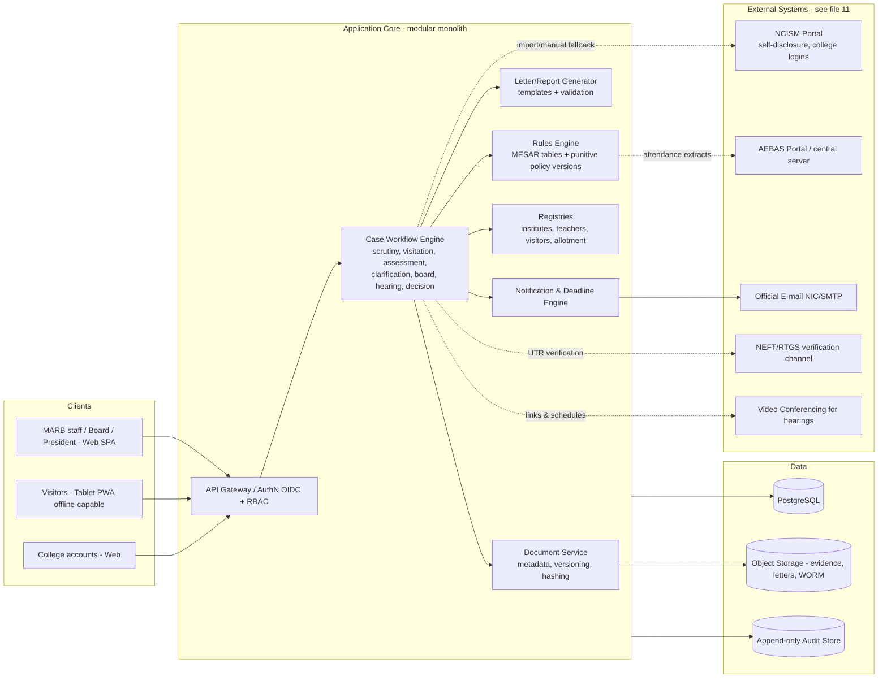
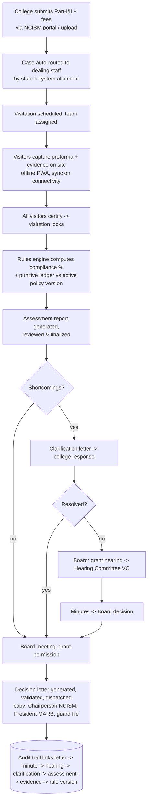

# 06 — Technical Architecture

> Part of the [SRS suite](README.md). **The entire technology selection in this file is `[INFERRED]`** — no source document names any implementation technology (user-approved approach; see ASM-009 in [12-gaps-and-questions.md](12-gaps-and-questions.md)). What *is* source-grounded: the integration landscape (NCISM portal, AEBAS, CCTV central server, e-mail, NEFT/RTGS, VC hearings) and the data/workflow shapes the architecture must serve.

## 1. Architectural drivers (source-grounded)

| Driver | Source |
|--------|--------|
| Long-running, multi-actor case workflows with statutory states (scrutiny → visitation → assessment → clarification → board → hearing → decision → appeal) | Board meeting Agenda (0)/(1); letters; [08-workflows.md](08-workflows.md) |
| Versioned rule tables (MESAR schedules per system/level) and per-session punitive policy | UG/PG MESAR Schedules; PUNITIVE POLICY § final para |
| Heavy document/evidence management incl. field-captured photos/videos | AYU0659 § Certification; Board meeting Agenda (1) Minutes |
| Field data capture at low-connectivity college sites | AYU0659 § header (rural addresses) |
| Statutory letter generation with strict template validation | clarification/hearing letter formats |
| External systems: NCISM portal (self-disclosure/logins), AEBAS portal, CCTV central server, official e-mail, NEFT/RTGS | UG Ayurveda 2024 §§ 6, 8–11, 55(2), 63(3); GAP-006 |
| Auditability strong enough for appeals and criminal proceedings | PG Ayurveda 2024 § Ch. XII 58 |

## 2. Proposed stack `[INFERRED]`

| Layer | Proposal | Reasoning |
|-------|----------|-----------|
| Frontend | **React + TypeScript** SPA; responsive; PWA offline mode for the visitation proforma | Mature ecosystem; PWA satisfies NFR-022 offline capture without a separate native app |
| Backend | **Java 21 / Spring Boot** modular monolith (REST) | Long-lived government systems favour a widely staffable, conservative platform; a modular monolith fits one team + one bounded domain, avoiding premature microservices |
| Workflow | Embedded state machine per case type (e.g., Spring StateMachine) with states/transitions from [08-workflows.md](08-workflows.md) | Statutory transitions must be explicit, testable and auditable |
| Rules | Versioned decision tables persisted in DB, evaluated by a rules component (e.g., Drools or bespoke evaluator) | Punitive policy/MESAR tables change by gazette/Board approval, not deployment (NFR-006, C-02) |
| Database | **PostgreSQL** | Relational integrity across ~40 entities ([10-data-model.md](10-data-model.md)); JSONB for proforma line payloads; strong audit tooling |
| Document/media store | **S3-compatible object storage** (e.g., MinIO on-prem or cloud equivalent) with SHA-256 hashing, WORM/immutability on finalized objects | Evidence integrity NFR-013; multi-GB media NFR-005 |
| Search | PostgreSQL full-text initially; OpenSearch if document-content search grows | Start simple; FR-093 scope is keyed lookups plus letter text |
| PDF/letter generation | Server-side templating (e.g., Thymeleaf/wkhtmltopdf or JasperReports) with template-validation test suite | FR-082 validations (dates, sessions, copy-to) |
| Notifications | Transactional e-mail service (government SMTP/NIC e-mail preferred) + in-app inbox | BR-106: e-mail is the official channel |
| AuthN/AuthZ | OIDC SSO; internal users via departmental IdP if available, else local accounts + TOTP MFA; college accounts credentialed per Institute ID; RBAC per [file 07](07-roles-permissions.md) | NFR-010/011; portal-login reuse pending Q-011 |
| Hosting | **MeitY-empanelled Indian cloud or NIC data centre**, two environments (staging/prod), IaC-managed | Government data-residency norms; NFR-020/021 |
| Observability | Centralized logs/metrics/traces; audit log stream to append-only store | NFR-030/031 |

## 3. Logical architecture

All external links are drawn dashed because their interface contracts are unconfirmed (GAP-006, Q-010–Q-013); each must have a manual-entry fallback (NFR-080).

## 4. Data flow (annual assessment happy path)

(Sequence grounded in: Board meeting Agenda (0)/(1); Assessment of Sardar PAtel...; clarification & hearing letters; PUNITIVE POLICY.)

## 5. API surface (internal)

REST/JSON, versioned (`/api/v1`), resource-oriented around the entities in [10-data-model.md](10-data-model.md): `/institutes`, `/applications`, `/visitations`, `/assessments`, `/clarifications`, `/board-meetings`, `/hearings`, `/decisions`, `/letters`, `/documents`, `/rules/policies`, `/rules/standards`, `/reports`. Workflow transitions are explicit sub-resources (e.g., `POST /assessments/{id}/finalize`) so RBAC and audit apply per transition. Detailed per-module API sketches are in [09-modules.md](09-modules.md); external integrations in [11-apis-integrations.md](11-apis-integrations.md).

## 6. Authentication & authorization mechanism

- **Internal users**: OIDC SSO (or local + TOTP MFA), roles per [file 07](07-roles-permissions.md); approval-capable roles require MFA (NFR-011).
- **Visitors**: internal-class accounts scoped to assigned visitations only; activated per engagement.
- **Colleges**: account per Institute ID bound to the registered official e-mail (BR-106; source: UG Ayurveda 2024 § 6, § 63(3)); scoped to own cases. Whether these credentials federate with the existing NCISM portal is open (Q-011).
- Authorization enforced server-side per resource + workflow transition; row-level scoping for college accounts and visitor assignments.

## 7. Storage & environments

- PostgreSQL for transactional data; object storage for documents/evidence with hash manifest per case; append-only audit store.
- Backups per NFR-050; retention per NFR-051 (pending Q-016).
- Environments: dev → staging (client UAT with migrated master data) → production. Data residency in India `[INFERRED — government norm]`.
