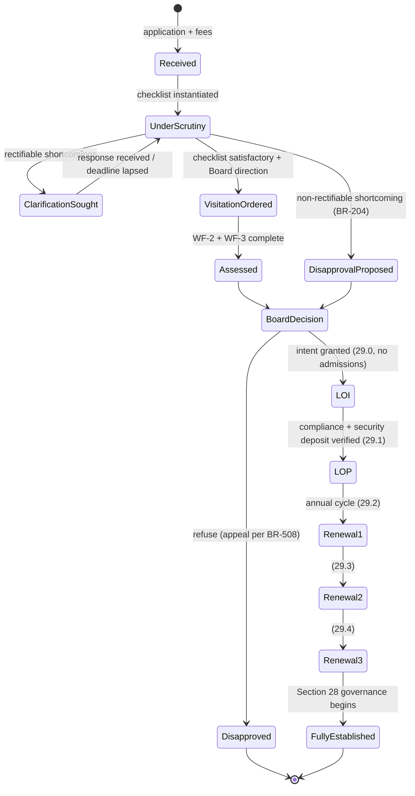
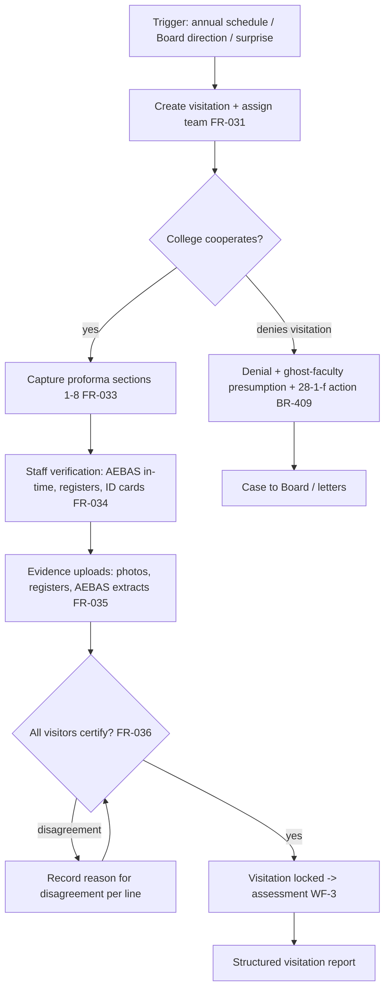
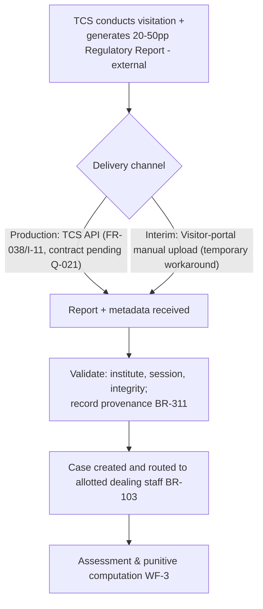
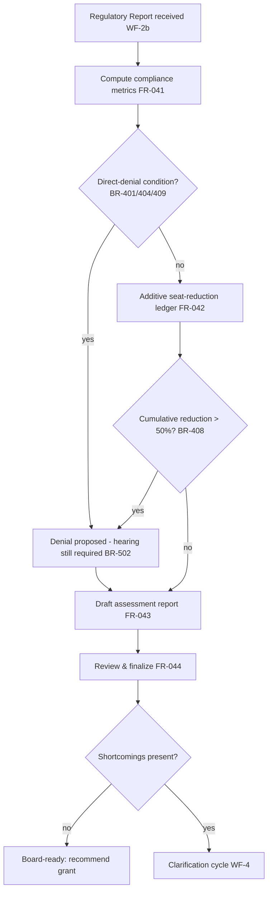
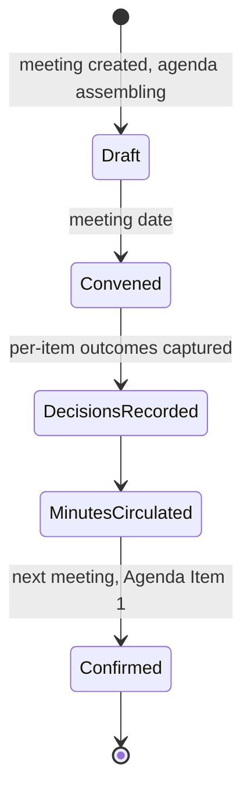
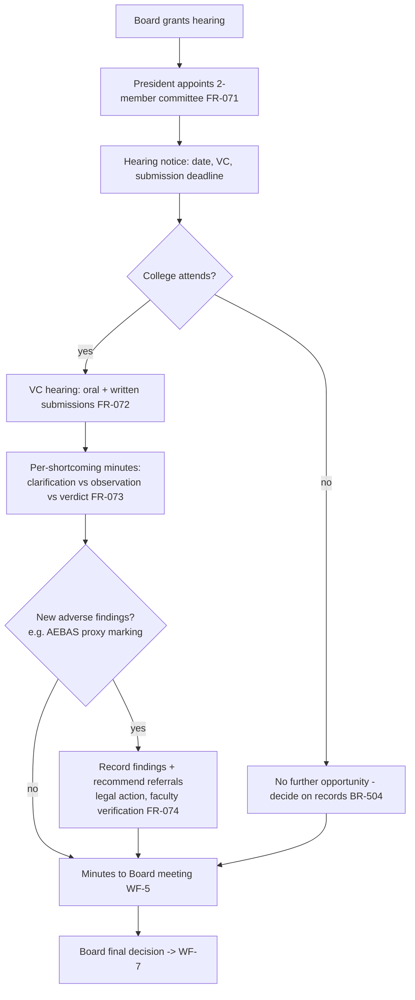
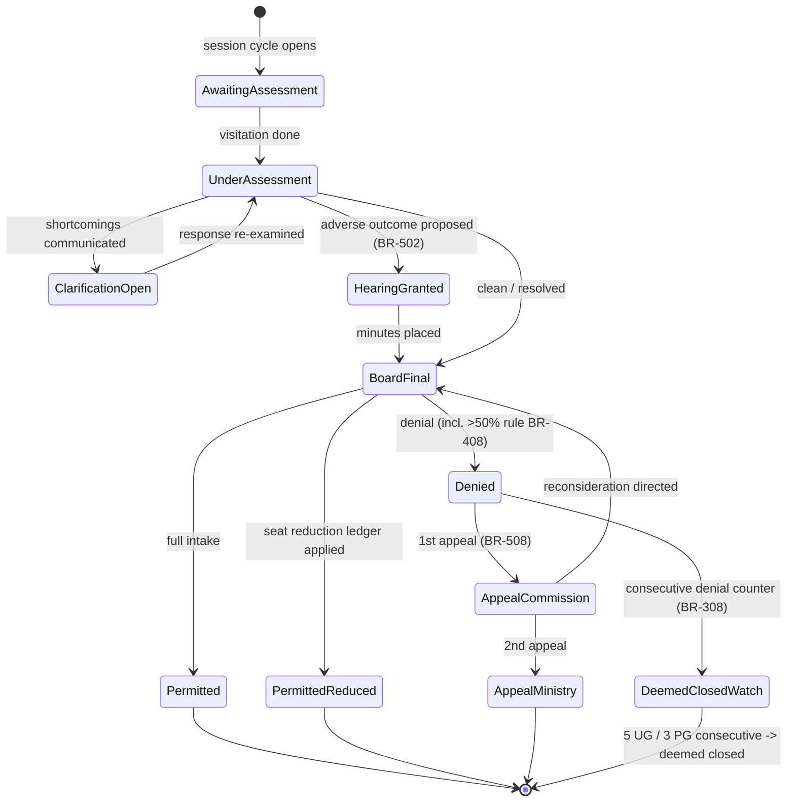

# 08 — Workflows

> Part of the [SRS suite](README.md). Each workflow lists trigger, actors (roles per [file 07](07-roles-permissions.md)), system actions (FR references per [file 04](04-functional-requirements.md)), decision points, state transitions and outcomes. Business rules `BR-xxx` per [file 03](03-business-requirements.md).

## WF-1 · New proposal — application & scrutiny (Section 29)

**Trigger:** application received for new UG college / new PG programme / standalone PG / intake increase / DM (BR-201), before the published last date (BR-203).
**Actors:** College (R7), Dealing Staff (R1, per allotment BR-103), Board (R2), Secretariat (R6).
**Grounding:** (source: Board meeting Agenda (0) § Agenda Item 2 (two scrutiny passes with clarification); UG Ayurveda 2024 §§ 57–65; PG Ayurveda 2024 § Ch. VIII).

Steps:

1. Register application; assign temporary ID (`YYYYTA###`) for new colleges (FR-021, BR-102); verify fees (FR-023, BR-208).
2. Instantiate regulation-driven document checklist (FR-022, BR-202).
3. Scrutiny pass: mark each item Submitted / Not submitted / Deficient / N-A (FR-024).
4. **Decision point — findings class (BR-204):** fulfilling → proceed; rectifiable → clarification cycle (bounded, AMB-007); **non-rectifiable** (hospital non-functional, land dispute, missing essentiality/COA, constructed-area deficiency) → disapproval route, no rectification.
5. Clarification letters ↔ college responses recorded per item (FR-025); re-scrutiny (2nd report version).
6. Scrutiny report placed before Board meeting (WF-5); Board directs visitation (WF-2) or disapproval.
7. Post-visitation & assessment: Board decides → LOI (29.0) → compliance + security deposit → LOP (29.1, permanent Institute ID + credentials) → renewals 29.2–29.4 → fully established (FR-027, BR-207). 6-month decision clock enforced throughout (BR-206).

**Outcome:** disapproval (with appeal rights) or progression along the LOI→LOP→renewal ladder.

## WF-2 · Visitation — **External (TCS)**

> **⚠️ Scope revision:** this workflow is executed **upstream by TCS** (ASM-002 revision, GAP-011) — TCS conducts the visitation and authors the 20–50-page Regulatory Report. It is retained here as domain context from the client documents; the platform's own entry point is **WF-2b (report receipt)** below.

**Trigger:** annual suo-moto schedule (Section 28, BR-303), Board direction on a Section-29 case, or a surprise re-visit (BR-310).
**Actors:** Dealing Staff (R1, scheduling), Visitors (R5), College (R7, hosts + Part-I/II), President/Board (visit ordering).
**Grounding:** (source: AYU0659 §§ Visitation/Visitor Details, 1–8, Certification; hearing letters § "visited on … on hybrid mode"; PUNITIVE POLICY §§ Note (i)-(ii), 12).

Steps:

1. Create visitation (ID `A#####`, purpose, session, mode physical/virtual/hybrid, dates) and assign team with conflict screening (FR-031, SoD-02).
2. College's Part-I/Part-II recorded (FR-032); if visit precedes Part-I, flag assessment basis = visit observations (BR-310).
3. On site: visitors fill the digital proforma per section (FR-033), verify staff individually (FR-034), attach evidence (FR-035).
4. **Decision point — college denies visitation?** → denial of permission + all faculty presumed ghost + §28(1)(f) action (BR-409).
5. Each visitor completes certification blocks; report locks when all certify (FR-036).

**Outcome:** locked, certified visitation report — or a denial route on non-cooperation.

## WF-2b · Regulatory-report receipt (platform boundary)

**Trigger:** TCS completes the visitation and generates the Regulatory Report (WF-2, external).
**Actors:** TCS system (production), Visitor account (interim uploader), system (routing by BR-103 allotment).
**Grounding:** client scope instruction — the TCS boundary and API are not described in any corpus document (`⚠️ Assumption` for delivery mechanics; GAP-011/ASM-012/Q-021).

Steps:

1. **Production:** TCS exposes the report via its API; the platform receives report + metadata (FR-038, I-11) — contract pending (Q-021).
2. **Interim workaround:** an authenticated Visitor-portal user manually uploads the TCS-generated report PDF (temporary until the API is available; not production architecture).
3. Receipt validation: institute resolvable, session stated, file integrity; provenance recorded (source, timestamp, identity, hash — BR-311).
4. Case created in the received state and routed to the allotted dealing staff (BR-103) → WF-3.

**Outcome:** a registered Regulatory Report opening a case at the platform boundary.

## WF-3 · Assessment & punitive computation

**Trigger:** Regulatory Report received (WF-2b).
**Actors:** system rules engine, Dealing Staff (R1 draft), Board Member/President (finalize — Q-003).
**Grounding:** (source: Assessment of Sardar PAtel... (report structure incl. punitive columns); PUNITIVE POLICY §§ 1–13; Hearing letter without clarification format (percentage formulas)).

Steps:

1. Rules engine computes compliance (FR-041): staff % per category, HF/LF per department, areas with 20% relaxation, equipment means, hospital functionality metrics, AEBAS analysis (FR-045).
2. Punitive engine builds the seat-reduction ledger against the active policy version (FR-042):
   - direct denial checks first (AEBAS absent BR-401; zero-faculty department BR-404; visitation denied BR-409);
   - additive reductions (teaching 5%/faculty BR-402; non-teaching BR-403; hospital staff BR-406; registration/OPD/occupancy/functionality BR-407);
   - **>50% cumulative → denial** (BR-408); ghost-faculty penalties & code revocations proposed (BR-405).
3. Assessment report generated (FR-043), reviewed and finalized (FR-044).
4. **Decision point:** no shortcomings → board-ready for grant; shortcomings → clarification (WF-4).

**Outcome:** finalized assessment with reproducible ledger, routed to grant recommendation or clarification.

## WF-4 · Clarification cycle

**Trigger:** finalized assessment lists shortcomings.
**Actors:** Dealing Staff (R1), Board Member (R2, signs letter), College (R7).
**Grounding:** (source: clarification letter format § all; Hearing letter with clarification format § clarification history; BR-501–BR-503).

1. Clarification letter generated from the shortcoming list with deadline (configurable — CON-006), signed, dispatched, logged (FR-051, FR-083).
2. College response captured per shortcoming (FR-052); deadline breaches flagged.
3. Re-examination marks each item resolved/unresolved (FR-053).
4. **Decision point:** all resolved → board-ready for grant; unresolved and adverse (seat reduction/denial in prospect) → Board with hearing recommendation (BR-502).

## WF-5 · Board meeting

**Trigger:** scheduled numbered meeting of MARB-ISM.
**Actors:** Secretariat (R6), Board Members (R2), President (R3).
**Grounding:** (source: Board meeting Agenda (0) §§ Items 1–6; Hearing letters § "placed in the 134th/124th Board meeting"; BR-506).

1. Agenda assembled: Item 1 = confirmation of previous minutes (auto), then scrutiny reports, assessment reports, hearing minutes, other matters (FR-061).
2. Per item, decision captured: grant / deny / grant hearing / defer / re-visit (FR-062).
3. Minutes generated; confirmed at next meeting (FR-063).
4. Punitive-policy versions take effect only with recorded Board approval (FR-016, SoD-04).

## WF-6 · Hearing

**Trigger:** Board decision to grant a hearing before seat reduction/denial (BR-502; reg. 55(14) MESAR UG Ayurveda 2024).
**Actors:** President (R3, appoints committee), Hearing Committee (R4), College (R7), Secretariat (R6), Board (R2).
**Grounding:** (source: Hearing letter with/without clarification formats; Board meeting Agenda (1) Minutes § Agenda Item 6; BR-503–BR-505).

1. Committee appointed (2 members observed); hearing scheduled (VC); notice generated in the applicable variant (with/without prior clarification) including show-cause text and submission deadline (FR-071).
2. College e-mails scanned original documents before deadline (FR-072).
3. **Decision point — attendance:** college absent → forfeits further opportunity; case decided on records (BR-504).
4. Hearing conducted; minutes captured per shortcoming: clarification given / committee observation / considered-or-not, plus new findings (FR-073).
5. Minutes placed before President/Board (WF-5) for final decision (FR-074).

## WF-7 · Decision & letters

**Trigger:** Board final decision on a case.
**Actors:** Board Member (R2), President (R3), Secretariat (R6, dispatch), College (R7, recipient).
**Grounding:** (source: letters § signature/copy-to; PUNITIVE POLICY § Note (v); BR-507, BR-411, BR-508).

1. Decision recorded: permission (full/reduced, ledger attached) / conditional (Sowa-Rigpa) / denial / penalties / code revocations (FR-081, FR-085).
2. **Decision point — counselling already notified?** → punitive effect shifts to subsequent session (BR-411).
3. Letter generated with template validation (dates ordered, session consistent) and mandatory copy-to (Chairperson NCISM, President MARB, guard file); signed; dispatched; logged (FR-082, FR-083).
4. Appeal windows tracked: Commission (15–30 days) → Ministry of Ayush (7–15 days) (FR-084, BR-508).

### College-session permission state machine (Section 28 view)

## WF-8 · Ghost-faculty / fraud handling (cross-cutting)

**Trigger:** AEBAS analysis, register mismatches or hearing findings indicate faculty "physically absent but present only on paper" or fabricated records.
**Actors:** Visitors (R5, evidence), Dealing Staff (R1), Hearing Committee (R4), Board (R2), President (R3).
**Grounding:** (source: PUNITIVE POLICY §§ 4–5, 12; Board meeting Agenda (1) Minutes (proxy AEBAS marking case); Board meeting Agenda (0) § Agenda Item 3 (multiple-register manipulation)).

1. Evidence assembled: AEBAS logs vs physical presence, multiple attendance registers, CCTV availability, QR-code custody, salary statements (FR-035, FR-045).
2. Faculty flagged as suspected ghost; excluded from availability counts for permission math (BR-405).
3. Hearing gives the college and (where directed) individual faculty an opportunity (Board minutes recommend one-to-one physical verification — FR-074).
4. On confirmation: ₹25 lakh/faculty penalty registered; teacher-code revocation per offence ladder (1yr/2yr/permanent) propagated to the teacher registry, blocking future employment counts nationwide (FR-085, FR-013).
5. Referrals for disciplinary/legal action tracked as follow-ups (FR-074).

## WF-9 · Annual rating (later phase — Q-009)

**Trigger:** session rating cycle for eligible (fully established, Extended Permission) institutions/departments (BR-601).
**Actors:** MARB / rating agency, College, Board(s) setting parameters.
**Grounding:** (source: UG Ayurveda 2024 § 56; UG Unani 2023 § 17; UG Sowa-Rigpa 2023 § 14; PG Ayurveda 2024 § Ch. IX).

1. Eligibility computed (FR-101); rating fee verified (BR-208).
2. Score assembled: 70% online self-disclosure + 30% physical verification (FR-102, BR-602).
3. Grade banded (A–D; Sowa-Rigpa A–C /400) (BR-603); Board approval; publication feed before counselling (FR-103, BR-604).
4. Grade consequences enforced in other workflows: expansion applications require A/B; §28(1)(f) action auto-withdraws the grade (BR-604).
