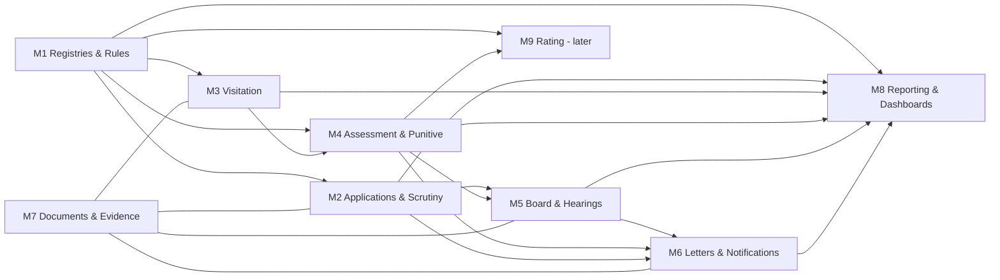

# 09 — Modules

> Part of the [SRS suite](README.md). Each module: objective, features (FR refs → [file 04](04-functional-requirements.md)), inputs/outputs, dependencies, users (roles → [file 07](07-roles-permissions.md)), and a developer view (entities → [file 10](10-data-model.md); APIs → [file 06 §5](06-technical-architecture.md)). Developer-view details (endpoints, edge cases) are engineering elaborations of the sourced requirements — treat naming as `[INFERRED]` convention.

---

## M1 — Registries & Master Data

**Objective:** single source of truth for institutes, teachers, visitors, staff allotment and regulation reference tables (FR-011…FR-017).
**Features:** institute CRUD + migration/cleansing; teacher registry with code-revocation ladder; visitor registry; work-allotment table driving routing; versioned MESAR standards tables; punitive-policy version management; master search.
**Inputs:** legacy Excel master (672 rows), Part-I staff lists, gazette schedule re-keys, Board-approved policy documents. **Outputs:** canonical registries, active rule versions, routing decisions.
**Users:** R1 (read/update own states), R8 (maintain), R6 (policy activation), all (read).
**Dependencies:** none (foundation module); consumed by M2–M8.
**Sources:** Master data of institute § All File Number; Work Allotment in Staff.md § Sheet1; PUNITIVE POLICY § final para; UG/PG MESAR Schedules.

**Developer view**
- Entities: `Institute`, `Teacher`, `TeacherCodeRevocation`, `Visitor`, `WorkAllotment`, `StandardsTable`/`StandardsLine`, `PunitivePolicyVersion`/`PunitiveRule`.
- APIs: `GET/POST/PATCH /institutes`, `/teachers`, `/visitors`, `/allotments`, `GET /rules/standards?system=AYU&level=UG&version=2024`, `POST /rules/policies/{id}/activate` (Board ref required).
- Backend logic: routing resolver `(state, system) → dealingStaff[]`; revocation-ladder counter per teacher (offence 1→1yr, 2→2yr, 3→permanent — PUNITIVE POLICY § 5); referential guard: institute deactivation blocked while open cases exist.
- Frontend: registry grids with filters (state/system/status), institute 360° page (cases, letters, history), policy-version diff view.
- Validations: Institute ID `^[A-Z]{2,4}\d{4}$`; temp-ID `^\d{4}T[AU]\d{3}$`; state ∈ Indian states/UTs; e-mail/phone formats (nullable per legacy quality).
- Edge cases: duplicate teacher across colleges (multi-employment fraud signal — surface, don't silently merge); institute with missing e-mail (block letter dispatch until fixed); mid-year allotment change (re-route open cases, FR-004).
- Errors: activation of a policy version without Board-meeting reference → 422 with rule SoD-04.

## M2 — Applications & Scrutiny (Section 29)

**Objective:** digitize proposal intake and the scrutinization checklist lifecycle through LOI/LOP/renewals (FR-021…FR-027).
**Features:** application registration + temp IDs; regulation-driven checklists with per-item status and certificate validity; fee recording (UTR); scrutiny report versions; clarification cycles; 6-month decision clock; LOI→LOP→renewal ladder with security-deposit tracking.
**Inputs:** application forms/documents, fee proofs, clarification responses. **Outputs:** scrutiny reports, board-ready cases, LOI/LOP/renewal records, permanent Institute IDs.
**Users:** R7 (submit), R1 (process), R2/R3 (approve), R6 (agenda).
**Dependencies:** M1 (checklists from standards tables; IDs), M6 (letters), M5 (board), M7 (documents).
**Sources:** Board meeting Agenda (0) § Agenda Item 2; UG Ayurveda 2024 §§ 57–65, Forms 29A–E; UG Unani 2023 § 18, Forms A–E; PG regs Ch. VIII, Forms A–G.

**Developer view**
- Entities: `Application`, `ChecklistItem`, `FeePayment`, `ScrutinyReport`, `ClarificationRequest` (scrutiny-scope), `PermissionGrant` (LOI/LOP/ROP), `SecurityDeposit`.
- APIs: `POST /applications`, `GET /applications/{id}/checklist`, `PATCH /checklist-items/{id}`, `POST /applications/{id}/scrutiny-reports`, `POST /applications/{id}/clarifications`, `POST /applications/{id}/decision`.
- Backend logic: checklist factory keyed by (type, system, level, regulation version); non-rectifiable classifier (BR-204 codes) short-circuits to disapproval route; decision-clock scheduler (6 months, BR-206) emits escalations; LOP handler mints permanent Institute ID (BR-102) and triggers credential issuance note.
- Frontend: checklist workbench with tri-state chips + "after clarification" history column (mirrors Agenda (0) table); fee panel with matrix validation; ladder timeline (29.0→29.4).
- Validations: fee amount vs matrix (type × system × slab); certificate validity windows (essentiality/COA 2 years — Agenda (0)); application after last date → reject (BR-203); withdrawal blocked post last date.
- Edge cases: document in regional language (status "submitted but not clear", clarification cycle — Agenda (0) hospital-registration row); government college exemptions (security deposit N/A on undertaking — BR-205); MoU-based interim facilities recorded as observations, not compliance.
- Errors: decision without required scrutiny report version → 409; clarification beyond configured cycle bound → requires supervisor override (AMB-007).

## M3 — Visitation Management

**Objective:** schedule visits, capture certified structured findings and evidence in the field (FR-031…FR-037).
**Features:** visitation creation with modes and conflict-screened team assignment; Part-I/II intake; offline-capable digital proforma (sections 1–8); per-teacher verification; evidence attachments; per-visitor certification & lock; surprise re-visits.
**Inputs:** Part-I/II data, on-site observations, media, AEBAS extracts. **Outputs:** locked visitation report feeding M4.
**Users:** R1 (schedule), R5 (capture/certify), R7 (Part-I/II), R3 (order re-visits).
**Dependencies:** M1 (standards → Required columns; visitor registry), M7 (evidence storage).
**Sources:** AYU0659/AYU0038/AYU0265 full structure; PUNITIVE POLICY Notes (i)-(ii), § 12; UG Ayurveda 2024 § 55(10)-(11).

**Developer view**
- Entities: `Visitation`, `VisitationAssignment`, `ProformaSection`/`ProformaLine`, `StaffVerification`, `EvidenceItem`, `VisitorCertification`, `PartSubmission` (I/II).
- APIs: `POST /visitations`, `POST /visitations/{id}/assignments`, `PUT /visitations/{id}/proforma/{section}`, `POST /visitations/{id}/evidence`, `POST /visitations/{id}/certifications`, `POST /visitations/{id}/lock`.
- Backend logic: Required-value auto-fill from `StandardsTable` by intake slab; lock only when all assigned visitors certified (FR-036); visit-before-Part-I flag switches assessment basis (BR-310); sync-merge for offline drafts (last-writer per line with conflict surfacing).
- Frontend: tablet-first PWA; section navigator mirroring the paper form; per-line Required/Actual/Match/Observation/Disagreement fields; camera capture; teacher checklist with AEBAS in-time entry; certification wizard.
- Validations: Actual values numeric/ranged; certification incomplete → lock blocked; evidence file types/size caps; visitor can edit only own observations/certification.
- Edge cases: college denies visit (record refusal + evidence → BR-409 route); AEBAS device absent/mobile device usage observed (capture as finding — Agenda (0) Item 3); multiple conflicting attendance registers (attach both scans with time-stamped custody notes — Agenda (1)); visitor disagreement (reason captured per line, report still lockable — AYU0659 Certification).
- Errors: proforma edit after lock → 423 Locked; assignment of visitor from subject college → 422 (SoD-02).

## M4 — Assessment & Punitive Engine

**Objective:** deterministic computation of compliance and punitive consequences, and generation of the assessment report (FR-041…FR-045).
**Features:** compliance calculators (staff %, HF/LF, areas w/ 20% relaxation, equipment means, hospital metrics); AEBAS analysis; punitive ledger with denial triggers; report generation; review/finalize with versioning.
**Inputs:** locked visitation + Part-I/II + AEBAS extracts + active policy version. **Outputs:** assessment report, seat-reduction ledger, shortcoming list, penalty/revocation proposals.
**Users:** R1 (draft/review), R2/R3 (finalize — Q-003).
**Dependencies:** M1 (standards, policy), M3 (visitation), M6 (report rendering).
**Sources:** Assessment of Sardar PAtel... (report + punitive columns); PUNITIVE POLICY §§ 1–13; Hearing letters (formulas); AYU0659 §§ 7–8.

**Developer view**
- Entities: `Assessment`, `ComplianceMetric`, `Shortcoming`, `PunitiveLedger`/`LedgerLine`, `AebasAnalysis`/`AebasFlag`.
- APIs: `POST /assessments (from visitationId)`, `POST /assessments/{id}/compute`, `GET /assessments/{id}/ledger`, `POST /assessments/{id}/finalize`, `POST /assessments/{id}/recompute (new visit / clarification)`.
- Backend logic (pure, unit-tested against corpus examples — SC-02):
  - `staffPct = available/required × 100` excluding excess (Hearing letter formula);
  - HF/LF classifier per department vs cadre requirement strings ("1P And 1R +2L") (ASM-004);
  - area check: shortfall ≤ 20% of requirement → relaxed-pass (BR-305, AMB-002);
  - equipment mean = mean(Essential%, General%) (BR-306, threshold configurable — Q-005);
  - ledger: denial gates (BR-401/404/409) → additive lines (BR-402/403/406/407) → Σ > 50% ⇒ denial (BR-408); rounding rules configurable and versioned.
- Frontend: computation workbench (inputs left, ledger right, rule citations inline); diff view between assessment versions; finalize gate with SoD-01.
- Validations: compute blocked on unlocked visitation; policy version must match session; manual overrides require reason + leave the auto value visible.
- Edge cases: visitor-observed extra staff ("0+1vo" notation — Hearing letter table) handled as visitor-adjustment fields; department with excess in one cadre but HF shortfall (excess never offsets — "Excluding Excess"); permission already issued + counselling notified → ledger effect deferred to next session (BR-411).
- Errors: recompute after finalize → creates new version, never mutates; missing required Part data → compute completes with explicit "basis: visit observations" flag (BR-310).

## M5 — Board Meetings & Hearings

**Objective:** run the collective decision layer: agendas, decisions, minutes, hearing committees and hearing minutes (FR-061…FR-074).
**Features:** numbered meetings; auto Agenda Item 1 (minutes confirmation); agenda assembly from board-ready cases; per-item decision capture; minutes generation/confirmation; hearing appointment/scheduling/notice; submission intake; per-shortcoming hearing minutes; outcome routing.
**Inputs:** board-ready cases, hearing submissions. **Outputs:** decisions, confirmed minutes, hearing minutes, follow-up referrals.
**Users:** R6 (administer), R2 (decide), R3 (appoint/approve), R4 (hearing minutes), R7 (submissions).
**Dependencies:** M2/M4 (cases), M6 (notices), M7 (bundles).
**Sources:** Board meeting Agenda (0) §§ 1–6; Board meeting Agenda (1) Minutes § 6; hearing letter formats; BR-502…BR-507.

**Developer view**
- Entities: `BoardMeeting`, `AgendaItem`, `BoardDecision`, `MeetingMinutes`, `Hearing`, `HearingCommitteeMember`, `HearingSubmission`, `HearingMinuteLine`, `FollowUpAction`.
- APIs: `POST /board-meetings`, `POST /board-meetings/{id}/agenda-items`, `POST /agenda-items/{id}/decision`, `POST /board-meetings/{id}/minutes/confirm`, `POST /hearings`, `POST /hearings/{id}/submissions`, `PUT /hearings/{id}/minutes`.
- Backend logic: meeting numbering monotonic; Item-1 auto-link to previous meeting's minutes (BR-506); hearing creation requires Board decision reference + President appointment (SoD-03); non-attendance auto-verdict flow (BR-504); minute lines keyed to shortcoming IDs so decisions trace to specific defects.
- Frontend: agenda builder (drag board-ready cases); decision console per item; hearing bundle viewer (assessment + clarification + submissions side-by-side, mirroring the 3-column minutes of Agenda (1)); minute editor with verdict picker (considered / not considered + reason).
- Validations: decision options constrained by case state; hearing date > notice date and submission deadline < hearing date (CON-003 regression); committee size/roles per configuration.
- Edge cases: new findings during hearing (e.g., AEBAS proxy marking) appended as extra minute lines + follow-up referrals (Agenda (1)); college attends but submits nothing; minutes comment/objection cycle before confirmation.
- Errors: minutes confirmation without next meeting → held in `Circulated`; hearing minutes edit after Board placement → 423.

## M6 — Letters & Notifications

**Objective:** generate, validate, sign and dispatch all statutory correspondence; run the deadline/notification engine (FR-051, FR-071, FR-081…FR-083, FR-092).
**Features:** template library (clarification, hearing ×2, decision, LOI/LOP/renewal, penalty); merge-field generation with hard validations; reference numbering; signatory & copy-to management; e-mail dispatch + logs; deadline countdowns (6-month, 60-day, clarification/hearing/submission, certificate expiry, self-disclosure 10th).
**Inputs:** case data, shortcoming lists, decisions. **Outputs:** dispatched letters (PDF), notification stream, dispatch log.
**Users:** R1 (draft), R2/R3 (sign/approve), R6 (dispatch), R7 (receive/view).
**Dependencies:** M1–M5 (data), M7 (letter archive), e-mail integration (file 11).
**Sources:** all letter formats (headers "Øekad/Ref. No. … fnukad/Dated", subject conventions, copy-to blocks); UG Ayurveda 2024 § 6; deadlines per BR-206/BR-307/BR-302.

**Developer view**
- Entities: `LetterTemplate`, `Letter`, `DispatchLog`, `Notification`, `DeadlineTimer`.
- APIs: `POST /letters (templateId, caseId)`, `POST /letters/{id}/sign`, `POST /letters/{id}/dispatch`, `GET /notifications`, `GET /deadlines?scope=...`.
- Backend logic: merge from structured case data only (no free-text body edits below configurable markers); validation suite — session consistency across all fields (CON-002), date ordering issue < deadline < hearing (CON-003), recipient e-mail present (M1 guard), mandatory copy-to list per template; ref-number generator per configured scheme (GAP-008/Q-020, pluggable); scheduler emits notifications + supervisor escalations.
- Frontend: letter preview with validation-failure annotations; sign queue for R2/R3; dispatch console; college inbox view.
- Validations: dispatch blocked until signed; template changes versioned; deadline edits audited.
- Edge cases: e-mail bounce (dispatch status `Failed`, alert R1/R6, block downstream deadline start until re-sent); bilingual letterhead rendering; letter regeneration after data correction supersedes prior PDF with version chain.
- Errors: sign attempt by non-signatory → 403 (SoD-06); generation with unresolved validation → 422 listing failures.

## M7 — Document & Evidence Management

**Objective:** authoritative store for all case documents and field evidence with integrity guarantees (FR-035, FR-091, NFR-013).
**Features:** typed uploads per regulation taxonomy; metadata (issuer, ref, issue/valid-until); versioning; WORM immutability post-finalization; SHA-256 hashing; validity-expiry alerts; full-text and metadata search; hearing-bundle assembly.
**Inputs:** uploads from colleges, visitors, staff. **Outputs:** retrievable, integrity-verifiable documents; expiry alerts; bundles.
**Users:** all roles (scoped).
**Dependencies:** object storage (file 06); M1 taxonomy.
**Sources:** Board meeting Agenda (0) § Agenda Item 2 (certificate types, validity windows, annexure numbering); AYU0659 § Certification (enclosures); Board meeting Agenda (1) (video/QR evidence).

**Developer view**
- Entities: `Document`, `DocumentVersion`, `DocumentType`, `EvidenceLink` (document ↔ proforma line/shortcoming/minute), `Bundle`.
- APIs: `POST /documents`, `GET /documents/{id}`, `POST /documents/{id}/versions`, `POST /bundles (caseId, purpose=hearing)`, `GET /documents/expiring?days=60`.
- Backend logic: hash at ingest; immutability flag set by case finalization events; annexure numbering within bundles (mirrors "Annexure-1…15" practice in Agenda (0)); AV scan on upload.
- Validations: type-specific required metadata (e.g., fire NOC requires valid-until); size/type caps; duplicate-hash detection (same document resubmitted).
- Edge cases: regional-language documents (flag for transcript requirement — PG regs require Hindi/English transcript); scanned originals for hearings must be PDF (letter instruction); expired certificate uploaded (accepted but auto-flagged deficient).
- Errors: mutation of WORM object → 423; download of another college's document by R7 → 403.

## M8 — Reporting & Dashboards

**Objective:** operational visibility and statutory reporting (FR-093…FR-095).
**Features:** global search; pipeline dashboards per role; standard reports (pipeline by state/system, session decisions, punitive register, hearing outcomes, deemed-closure watchlist, fees, visitor engagement, allotment load); exports.
**Inputs:** all module data. **Outputs:** dashboards, report files.
**Users:** R1 (own scope), R2/R3/R9 (all), R6, R8 (system).
**Dependencies:** M1–M7.
**Sources:** implied by Work Allotment totals (load view), Board agenda summaries, deemed-closure counters (BR-308), 60-day deadline (BR-307).

**Developer view**
- Entities: read models/materialized views over case states; `ReportDefinition`.
- APIs: `GET /search?q=`, `GET /dashboards/{role}`, `POST /reports/{key}/run`.
- Backend logic: state-derived KPIs (cases by workflow state × state × system × session); consecutive-denial counter per institute/level for the deemed-closure watchlist; countdown computation vs configured counselling date.
- Frontend: role-scoped dashboard cards, drill-through to cases; watchlist views with severity.
- Edge cases: counselling date unset for a session (countdown suppressed with warning); merged/renamed institutes preserve history.
- Errors: exports of restricted data (penalties, hearing evidence) respect NFR-041 visibility rules.

## M9 — Rating (later phase, pending Q-009)

**Objective:** compute and publish annual ratings for eligible institutions/departments (FR-101…FR-103).
**Features:** eligibility determination; 70:30 score assembly; grade banding (A–D / Sowa-Rigpa A–C of 400); Board approval; publication export.
**Dependencies:** M1 (eligibility inputs), M3/M4 (physical component), self-disclosure feed (file 11), parameter sheets from the Boards (GAP-005).
**Sources:** UG Ayurveda 2024 § 56 Tables 12–13; UG Unani 2023 § 17; UG Sowa-Rigpa 2023 § 14 Table-5 & Annexure-VI/VI-A; PG Ayurveda 2024 § Ch. IX Tables 13–14.

**Developer view (outline)**
- Entities: `RatingCycle`, `RatingScorecard`, `RatingParameter`, `Grade`.
- Logic: eligibility = fully established ∧ Extended Permission ∧ ¬§28(1)(f); band function per system; auto-withdrawal trigger on §28(1)(f) events (BR-604).
- Edge case: PG rated per department while UG per college — scorecards scoped accordingly (PG Ayurveda 2024 § Ch. IX 46).

---

## Module dependency map

