# 10 — Data Model

> Part of the [SRS suite](README.md). Entities serve the modules in [09-modules.md](09-modules.md); attribute evidence cited per source. Physical naming/types are `[INFERRED]` engineering conventions over sourced fields.

## 1. Master vs transactional data

| Class | Entities | Change cadence |
|-------|----------|----------------|
| **Master** | Institute, Teacher, Visitor, WorkAllotment, DocumentType, LetterTemplate, StandardsTable/StandardsLine (MESAR schedules), PunitivePolicyVersion/PunitiveRule, FeeMatrix, AcademicSession | Slow; versioned; Board/gazette-driven |
| **Transactional** | Application, ChecklistItem, FeePayment, **RegulatoryReport (received; TCS-sourced)**, Visitation *(externally sourced — payload of the TCS report)*, ProformaLine, StaffVerification, EvidenceItem, Assessment, Shortcoming, PunitiveLedger, Clarification, BoardMeeting, AgendaItem, BoardDecision, Hearing, HearingMinuteLine, Decision, Letter, DispatchLog, Penalty, TeacherCodeRevocation, Appeal, RatingScorecard, AuditEvent | Per case/session |

> **⚠️ Scope revision:** `Visitation`, `ProformaLine`, `StaffVerification`, `EvidenceItem` and `VisitorCertification` are **not captured by this platform** — they arrive as the payload of the TCS-generated **`RegulatoryReport`** (production: TCS API; interim: Visitor upload). New receipt entity **`RegulatoryReport`** { id, institute_id, session, source_channel (`tcs_api`\|`interim_upload`), external_ref, received_at, content_hash, status } records provenance (BR-311, FR-038, GAP-011/ASM-012).

## 2. Entity-relationship diagram

```mermaid
erDiagram
    INSTITUTE ||--o{ APPLICATION : submits
    INSTITUTE ||--o{ VISITATION : "is visited"
    INSTITUTE ||--o{ TEACHER : employs
    INSTITUTE ||--o{ DECISION : receives
    INSTITUTE ||--o{ PERMISSION_GRANT : "holds (LOI/LOP/ROP)"
    WORK_ALLOTMENT }o--|| INSTITUTE : "routes by state+system"

    APPLICATION ||--|{ CHECKLIST_ITEM : "has"
    APPLICATION ||--o{ FEE_PAYMENT : "paid by"
    APPLICATION ||--o{ SCRUTINY_REPORT : "scrutinized in"
    APPLICATION ||--o{ CLARIFICATION : "may raise"

    VISITATION ||--|{ VISITATION_ASSIGNMENT : "staffed by"
    VISITOR ||--o{ VISITATION_ASSIGNMENT : "serves"
    VISITATION ||--|{ PROFORMA_LINE : "records"
    VISITATION ||--o{ STAFF_VERIFICATION : "verifies"
    TEACHER ||--o{ STAFF_VERIFICATION : "is verified"
    VISITATION ||--o{ EVIDENCE_ITEM : "collects"
    VISITATION ||--|{ VISITOR_CERTIFICATION : "certified by"
    PART_SUBMISSION }o--|| VISITATION : "baselines"

    REGULATORY_REPORT }o--|| INSTITUTE : "received for"
    REGULATORY_REPORT ||--o| VISITATION : "payload projects"
    REGULATORY_REPORT ||--o| ASSESSMENT : "computed from"
    VISITATION ||--o| ASSESSMENT : "assessed as"
    ASSESSMENT ||--|{ COMPLIANCE_METRIC : computes
    ASSESSMENT ||--|{ SHORTCOMING : identifies
    ASSESSMENT ||--o| PUNITIVE_LEDGER : produces
    PUNITIVE_LEDGER ||--|{ LEDGER_LINE : itemizes
    PUNITIVE_POLICY_VERSION ||--o{ LEDGER_LINE : "justified by rule"
    STANDARDS_LINE ||--o{ PROFORMA_LINE : "sets Required"

    SHORTCOMING ||--o{ CLARIFICATION : "clarified via"
    CLARIFICATION ||--o| LETTER : "communicated by"

    BOARD_MEETING ||--|{ AGENDA_ITEM : contains
    AGENDA_ITEM ||--o| BOARD_DECISION : "decided as"
    AGENDA_ITEM }o--o| ASSESSMENT : "places"
    AGENDA_ITEM }o--o| SCRUTINY_REPORT : "places"
    AGENDA_ITEM }o--o| HEARING : "places minutes of"

    HEARING ||--|{ HEARING_COMMITTEE_MEMBER : "heard by"
    HEARING ||--o{ HEARING_SUBMISSION : "receives"
    HEARING ||--|{ HEARING_MINUTE_LINE : minutes
    SHORTCOMING ||--o{ HEARING_MINUTE_LINE : "addressed in"

    BOARD_DECISION ||--o| DECISION : "issues"
    DECISION ||--o{ LETTER : "notified by"
    DECISION ||--o{ PENALTY : imposes
    PENALTY ||--o{ TEACHER_CODE_REVOCATION : "may include"
    TEACHER ||--o{ TEACHER_CODE_REVOCATION : "suffers"
    DECISION ||--o{ APPEAL : "appealed via"

    LETTER ||--o{ DISPATCH_LOG : "dispatched via"
    DOCUMENT ||--o{ EVIDENCE_ITEM : "backs"
    DOCUMENT }o--o{ CHECKLIST_ITEM : "satisfies"
    INSTITUTE ||--o{ RATING_SCORECARD : "rated by (later)"
```

## 3. Key entities & fields

### Institute (master)
| Field | Notes | Source |
|---|---|---|
| institute_id (PK) | `AYU0659`, `UNI0313`; prefix = system | Master data of institute § All File Number |
| temp_id | `2023TA001`-style pre-LOP | UG Ayurveda 2024 § 61 |
| system_of_medicine | AYU / UNI / SID / SR | Master data § col 2 |
| level_offerings | UG / PG / both | Board meeting Agenda (0) § Item 3 |
| name, address (structured), state, pincode | split from legacy combined cell | Master data § col 5 (CON-007) |
| file_number | MARB file ref, format varies | Master data § col 6 (GAP-008) |
| official_email, official_mobile | official channel (BR-106) | Master data §§ 7–8; UG Ayurveda 2024 § 6 |
| permission_category | Extended / Yearly / Conditional (SR) / Under-establishment | UG Ayurveda 2024 § 54; UG Sowa-Rigpa 2023 § 3 |
| establishment_stage | LOI / LOP / R1 / R2 / R3 / FullyEstablished | UG Ayurveda 2024 Table-16 |
| sanctioned_intake (per course) | slabs 60/100/150/200; SR ≤15/16–30; PG ≤12/programme | UG regs § 3; PG § Ch. II 3(10) |
| consecutive_denial_count | drives deemed-closure (BR-308) | UG Ayurveda 2024 § 55(12) |
| status | Active / DeemedClosed / RecognitionWithdrawn | ibid.; BR-412 |

### Teacher (master)
teacher_code (PK, `AYKC01861`), name, designation cadre (Prof/Assoc/Asst), department, current institute FK, state-board registrations (board, central reg. no.), code_status (Active/Revoked+until), offence_count — (source: AYU0659 §§ 3.1–3.6; PUNITIVE POLICY § 5; Board meeting Agenda (1) § employee-code table).

### Visitor (master)
visitor_id (PK, `V01408`), name, home_institute FK, system, ug_pg_eligibility, active flag — (source: AYU0659 § Visitor Details; PG Ayurveda 2024 § Ch. VI).

### StandardsTable / StandardsLine (master, versioned)
regulation (system × level × year), schedule ref (e.g., Schedule-V), category (area/staff/equipment/hospital/library…), department, requirement expression (e.g., "1P And 1R +2L", area m², counts per intake slab), relaxation_pct (20% where applicable) — (source: UG Ayurveda 2024 Schedules I–XXXI & Tables 1–9; AYU0659 Required columns).

### PunitivePolicyVersion / PunitiveRule (master, versioned)
session (2026-27), board_approval_ref (160th meeting), rule set: rule_code (BR-401…BR-411 mapping), trigger expression, consequence (denial / seats fixed / seats per-unit / % of intake / penalty ₹ / revocation), additive flag, cap rule (>50% denial) — (source: PUNITIVE POLICY §§ 1–13 & final para).

### Application (transactional)
application_id, institute/temp FK, type (NewUG/NewPG/StandalonePG/IntakeIncrease/DM), session, received_date, addressed_to, state machine status (WF-1), decision_due (received + 6 months) — (source: Board meeting Agenda (0) § Item 2; BR-206).

### ChecklistItem
application FK, doc_type FK, requirement text, status (Submitted/NotSubmitted/Deficient/NA/AfterClarification), annexure_no, document FK, validity dates, remarks — (source: Board meeting Agenda (0) § Item 2 table).

### FeePayment
payer institute FK, purpose (application/processing/visitation/digitization/rating/security-deposit), amount, mode (NEFT/RTGS), utr_ref, date, matrix line FK, verified flag — (source: Board meeting Agenda (0) § fees row; UG/PG fee tables; GAP-010).

### Visitation
visitation_id (`A06004`), institute FK, purpose, type (Annual/LOI/Renewal/Increase/ReVisit/Surprise), mode (Physical/Virtual/Hybrid), session, start/end dates, status (Planned/InProgress/Certified/Locked), basis_flag (Part-I present or visit-only per BR-310) — (source: AYU0659 § Visitation Details; PUNITIVE POLICY Notes (i)-(ii)).

### ProformaLine
visitation FK, section (1–8), standards_line FK (Required), actual value, documents_verified, matches (Y/N), visitor_observation, disagreement_reason — (source: AYU0659 § 2.1 columns).

### StaffVerification
visitation FK, teacher FK (or hospital-staff record), present flag, aebas_in_time, on_attendance_register, in_salary_roll, has_id_card, eligibility (Eligible/Rejected), rejection_reason, absence_reason — (source: AYU0659 §§ 3.2–3.5; Agenda (1) § in-time/status table).

### Assessment
visitation FK, version, status (Draft/Review/Final), computed metrics (staff % per category, equipment Essential/General/Mean %, OPD avg, bed occupancy %), policy_version FK, finalized_by/at — (source: Assessment of Sardar PAtel...; AYU0659 § 8.2).

### Shortcoming
assessment FK, category (TeachingStaff/NonTeaching/HospitalStaff/Infrastructure/Equipment/Functionality/AEBAS/Website/Docs), description, department, quantification (e.g., "1 HF"), regulation citation, status (Open/Clarified/Resolved/Upheld) — (source: letters' numbered defect lists; AYU0659 § 8.2).

### PunitiveLedger / LedgerLine
assessment FK; lines: rule FK, deficiency quantity, seats_reduced or action (Denial/Penalty/Revocation), computation trace; totals: sum, pct_of_intake, denial_triggered — (source: Assessment of Sardar PAtel... § 11–13 punitive columns; PUNITIVE POLICY math).

### Clarification
case FK (application or assessment scope), letter FK, deadline, response_ref/date, per-shortcoming response text, outcome (Resolved/Unresolved) — (source: clarification letter format; Hearing letter with clarification § response citation).

### BoardMeeting / AgendaItem / BoardDecision / MeetingMinutes
meeting_no (160), date/time, status; items: seq, type (MinutesConfirmation/Scrutiny/Assessment/HearingMinutes/Other), case FK, decision (Grant/GrantReduced/Deny/GrantHearing/Defer/ReVisit), decision text; minutes doc + confirmation link to next meeting — (source: Board meeting Agenda (0) §§ 1–6; BR-506).

### Hearing / HearingMinuteLine / HearingSubmission
case FK, board_decision FK, committee members (President-appointed), mode (VC), hearing date, submission deadline/email, attendance record; minute lines: shortcoming FK, college_clarification, committee_observation, verdict (Considered/NotConsidered + reason); new_findings; follow_up_actions — (source: Hearing letter formats; Board meeting Agenda (1) Minutes § Item 6).

### Decision / Penalty / TeacherCodeRevocation / Appeal
decision: institute FK, session, course/level, outcome (Permission/PermissionReduced/Conditional/Denial), granted_intake, ledger FK, effective_session (BR-411); penalty: type (GhostFaculty ₹25L / Regulation ≤₹1cr), amount, status; revocation: teacher FK, offence_no, duration (1y/2y/Permanent), period; appeal: level (Commission/Ministry), filed date, window check, outcome — (source: PUNITIVE POLICY §§ 4–5; PG Ayurveda 2024 § Ch. XII 58, Ch. VIII 44).

### Letter / DispatchLog
letter: template FK, case FK, ref_no, date, signatory FK, copy_to list, pdf document FK, validation status; dispatch: channel (e-mail), to, timestamp, delivery status — (source: all letter formats § header/copy-to).

### Document / EvidenceItem
document: type FK, issuer, ref_no, issue/valid_until, hash, version, WORM flag, language flag (transcript needed); evidence: document FK, link target (proforma line / shortcoming / minute line), custody note — (source: Board meeting Agenda (0) § annexures; Agenda (1) § QR/video evidence; PG regs transcript rule).

### AuditEvent
actor, action, entity ref, before/after, timestamp — (NFR-030).

## 4. Required documents & attachments (by process)

| Process | Documents | Source |
|---|---|---|
| New-college application | Form 29A/A; Essentiality Certificate (29C/C, valid 2 yrs); Consent of Affiliation (29E/E/G, valid 2 yrs); land title/lease/affidavits; zoning; building plans & completion/occupancy; fire NOC; pollution & BMW; hospital registration; NEET/exclusive-use/ratio affidavits; security deposit proof; fees; trust/society deeds; audited accounts; hospital registers (dispensing, indent, stock, raw-drug purchase); patient data (OPD/IPD/occupancy 2 yrs); staff lists + appointment/joining/relieving + degrees + registrations + teacher codes; bank salary statements (24 months); EPF/ESI | Board meeting Agenda (0) § Item 2 (full observed checklist); UG Ayurveda 2024 §§ 57–59 |
| Annual assessment | Part-I & Part-II proformas; COA for the year; compliance report; visitation-fee proof; monthly self-disclosure | Assessment of Sardar PAtel... § Other Observation; UG Ayurveda 2024 § 55 |
| Visitation evidence | photos/videos; attendance-register scans; AEBAS extracts; CCTV footage refs; duty rosters; hospital registers | AYU0659 § 8.1; Agenda (1) Minutes |
| Clarification/hearing | college response letters; scanned originals (PDF) per shortcoming | clarification & hearing letters |
| PG-specific | NABH certificate; PGNET affidavits; guide lists; dissertation/research records | PG Ayurveda 2024 § Ch. VIII 35, 40 |

## 5. Data-quality & migration notes

- Legacy master: header misspellings, combined name+address, `-` nulls → cleansing rules in FR-012 (CON-007, Q-015).
- Regulation schedules arrive as OCR-mangled tables → manual re-keying with dual-entry verification before rule tables go live (C-06).
- Observed report quirks the model must tolerate: "0+1vo" visitor-observed staff adjustments, "null is short by null" OCR artifacts, calendar-year hospital stats vs academic-year sessions (source: AYU0659; Explore digest of AYU reports).
