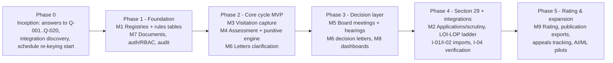

# 14 — Roadmap

> Part of the [SRS suite](README.md). Modules `M1–M9` per [09-modules.md](09-modules.md); risks per [13-risks.md](13-risks.md). **Everything in §4 (future enhancements) and §5 (AI/ML) is a clearly-marked proposal** — not sourced requirements — except where a regulation explicitly invites it (cited).

## 1. Implementation order & dependencies

Rationale for the order:
- **M1 + M7 first** — every workflow depends on clean masters, versioned MESAR tables and evidence-grade document handling; also the longest-lead data work (re-keying, migration — RSK-021/022).
- **M3 + M4 + clarification letters = MVP** because the annual Section-28 assessment cycle is the volume driver (all 672 institutes yearly) and the sources document it most completely (assessment reports, punitive policy, clarification letters). Delivering it before a visitation season yields immediate relief.
- **M5 next** — board/hearing digitization requires the upstream case data to exist.
- **M2 after** — Section-29 applications are fewer in number and today's scrutiny process, while laborious, is less deadline-critical than the annual cycle `[INFERRED prioritization — confirm volumes with client]`.
- **M9 last** — rating needs parameter sheets not yet available (GAP-005) and self-disclosure feeds (I-01).

## 2. MVP scope (Phase 1–2 exit)

| In MVP | Deferred |
|--------|----------|
| Institute/teacher/visitor masters (migrated), work-allotment routing | Appeals processing (status-only until Q-008) |
| MESAR standards tables for Ayurveda UG + one more system (pilot) | Full six-regulation coverage (staged per re-keying) |
| Visitation scheduling, offline proforma, evidence, certifications | Live AEBAS API (import/manual first) |
| Assessment computation + punitive ledger (golden-tested per SC-02) | Rating (M9) |
| Clarification letters + dispatch log + deadline engine | College self-service portal beyond case/letter view |
| Case audit trail end-to-end | Board meeting module (falls in Phase 3) |

Pilot recommendation: one high-volume state (e.g., Maharashtra, 155 Ayurveda colleges — source: Work Allotment in Staff.md § Sheet1) plus one small state, one full season in parallel-run. `[proposal]`

## 3. Dependency & sequencing constraints

- Q-004/Q-005/Q-006 (punitive math, thresholds, AEBAS rules) block M4 build — schedule the client workshop in Phase 0.
- Schedule re-keying (RSK-021) is on the critical path for M4's Required values — start immediately, per system of medicine, Ayurveda UG first.
- Punitive-policy version for the target session must be Board-approved before the season's first computation (C-02).
- Go-live windows must respect the season: deploy and train **before** visitation waves; freeze during the 60-day pre-counselling crunch (RSK-003).
- Siddha UG / Sowa-Rigpa PG segments blocked on missing regulations (RSK-043).

## 4. Future enhancements (proposals)

| # | Proposal | Justification |
|---|----------|---------------|
| FE-01 | **College self-service portal expansion** — full application filing, checklist visibility, fee status, deadline calendar | Reduces clarification cycles caused by incomplete submissions (observed 2-pass scrutiny in Board meeting Agenda (0)); regulations already envision online applications (UG Ayurveda 2024 § 60) |
| FE-02 | **Live AEBAS integration** with scheduled pulls and continuous attendance scoring | Regulation empowers online verification any working day (UG Ayurveda 2024 § 55(11)); removes manual extract handling |
| FE-03 | **Payment auto-reconciliation** (PFMS/Bharatkosh/bank API per Q-012) | Eliminates manual UTR verification (GAP-010) |
| FE-04 | **Hearing VC integration** (scheduling, attendance capture, recording custody) | Current practice communicates links "separately" (Hearing letter § body); integration closes an evidence gap |
| FE-05 | **Self-disclosure analytics** — trend monitoring per college across monthly uploads | Regulations mandate the monthly feed (UG Ayurveda 2024 § 55(2)); trends flag decline before visitation |
| FE-06 | **Counselling-system data exchange** (AACCC) with signed seat matrices | Removes the highest-consequence manual hand-off (RSK-044) |
| FE-07 | **Public transparency views** — published ratings, permitted-college lists with intake | Regulations require publication before counselling (UG Ayurveda 2024 § 56; BR-604) |
| FE-08 | **Digital signatures (DSC/eSign)** on letters and certifications | Strengthens non-repudiation (NFR-014) for appeal/legal contexts |
| FE-09 | **Hindi UI/letter localization** | Letterheads are bilingual today (ASM-008); full localization aids state-level users |

## 5. AI/ML integration opportunities (proposals)

The PG regulations explicitly empower MARB to move to "an **Artificial-Intelligence-based online system** for transparency" in application, verification, assessment and rating (source: NCISM(...Postgraduate...Ayurveda)-Regulations-2024 § Ch. VIII 43(5)) — so AI here is regulator-anticipated, not gratuitous. Ordered by value/feasibility:

| # | Opportunity | What it does | Justification & grounding |
|---|-------------|--------------|---------------------------|
| AI-01 | **AEBAS anomaly detection** | Models per-faculty attendance patterns (in-time clustering, device usage, simultaneous punches) to rank "suspicious" faculty for visitor follow-up | Directly targets the documented fraud mode: proxy marking with pre-recorded videos, mass 12:00 AM absences (source: Board meeting Agenda (1) Minutes § faculty table); replaces the undefined manual "suspicious" call (AMB-004) with an explainable score — human decision stays with MARB |
| AI-02 | **Document intelligence for scrutiny** | OCR + extraction over submitted certificates (issuer, ref no., validity dates, seat counts) to pre-fill checklist items and auto-flag expired/mismatched documents | Scrutiny today manually reads dozens of certificates per application, catching expiries like a fire NOC "expired on 23.03.2026" (source: Board meeting Agenda (0) § Item 3); high-volume, low-risk assistive use |
| AI-03 | **Cross-college ghost-faculty network detection** | Entity resolution over teacher names/codes/registrations to find faculty simultaneously claimed by multiple colleges or reappearing after revocation | Teacher discrepancy tables already track cross-state registrations (source: AYU0659 § 3.6); punitive policy's offence ladder (§ 5) requires reliable identity linking across the 672-college corpus |
| AI-04 | **Clarification-response triage** | NLP summarization of college clarification/hearing submissions mapped to each shortcoming, with claim-vs-evidence gap highlighting | Hearing committees manually align three columns (shortcoming/clarification/observation) per case (source: Board meeting Agenda (1) Minutes); assistive drafting of the alignment saves committee time — verdicts remain human |
| AI-05 | **Risk-scored visitation planning** | Predictive prioritization of colleges for surprise re-visits using history (prior deficiencies, denial patterns, self-disclosure trends) | Board already re-visits selectively (UG Ayurveda 2024 § 55(10)); scoring makes the selection defensible and consistent |
| AI-06 | **Letter QA copilot** | Language model check of generated letters against case data for residual inconsistencies beyond rule-based validation | Targets the observed CON-002/003 error class as defense-in-depth; low risk since it only flags |
| AI-07 | **Rating evidence scoring assistance** (Phase 5+) | Semi-automated scoring of the 70% online component from self-disclosure with drill-down evidence | Aligns with the regulation's 70:30 model (UG Ayurveda 2024 § 56(9)) and the AI-system mandate; needs parameter sheets (GAP-005) first |

**Guardrails for all AI features `[proposal]`:** assistive-only (no automated adverse decisions — natural-justice obligations per BR-502 require human determination); explainable outputs logged as audit evidence; training/evaluation data governed under the privacy posture of NFR-040; per-feature client sign-off.

## 6. Suggested timeline shape `[proposal — sizing requires client confirmation]`

| Phase | Indicative duration | Exit criteria |
|-------|--------------------|--------------------|
| 0 Inception | 4–6 weeks | Q-001…Q-020 answered; integration discovery done; re-keying begun |
| 1 Foundation | 8–10 weeks | Masters migrated (SC-06); Ayurveda-UG standards live; RBAC/audit operational |
| 2 Core cycle MVP | 10–12 weeks | SC-02 golden tests pass; pilot visitation season ready |
| 3 Decision layer | 8–10 weeks | Board/hearing modules in use; SC-01/SC-03 measurable |
| 4 Section 29 + integrations | 8–10 weeks | Scrutiny digitized; imports live |
| 5 Rating & AI pilots | ongoing | Per Q-009 and GAP-005 resolution |
